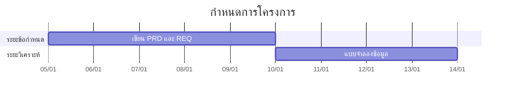

# กำหนดการโครงการ

| รายการ | รายละเอียด |
|---|---|
| รหัสเอกสาร | SCH-XXX-001 |
| ฉบับแก้ไขครั้งที่ | 00 |
| วันที่มีผลบังคับใช้ | YYYY-MM-DD |
| สถานะ | ร่าง / รอทบทวน / อนุมัติแล้ว |
| เอกสารอ้างอิง | WBS-XXX-001 rev NN · EST-XXX-001 rev NN |
| ผู้จัดทำ | [ชื่อ] |

---

## 1. ฐานของกำหนดการ

| รายการ | ค่า |
|---|---|
| วันเริ่มโครงการ | YYYY-MM-DD |
| วันสิ้นสุดตามแผน | YYYY-MM-DD |
| ความยาวหนึ่งรอบ | — |
| จำนวนรอบ | — |
| วันทำงานต่อสัปดาห์ | — |
| ชั่วโมงทำงานจริงต่อวัน | — |

วันหยุดและช่วงที่ทำงานไม่ได้

| ช่วง | เหตุผล | กระทบกี่วันทำงาน |
|---|---|---|
| — | — | — |

---

## 2. กำหนดการรายรอบ

| รอบ | เริ่ม | จบ | เป้าหมาย | ส่งมอบอะไร |
|---|---|---|---|---|
| 1 | — | — | — | — |
| 2 | — | — | — | — |

---

## 3. ผังกำหนดการ

ผังนี้ถูกเรนเดอร์เป็นรูปโดย `tools/render-mermaid.py` ก่อนสร้าง PDF

---

## 4. หมุดหมายและเกณฑ์

| หมุดหมาย | วันที่ตามแผน | เกณฑ์ว่าถึงแล้วจริง | ประตูที่เกี่ยวข้อง |
|---|---|---|---|
| ข้อกำหนดพร้อมส่งต่อ | — | ผ่าน Definition of Ready ครบทุกข้อ | G1 |
| แบบระบบเสร็จ | — | ผ่านรายการตรวจก่อนส่งมอบกลับ | G2 |
| ระบบออกแบบพร้อม | — | มี DSN ลงทะเบียน token ครบ | G3 |
| พัฒนาเสร็จ | — | ผ่าน Definition of Done | G4 |
| ทบทวนโค้ดผ่าน | — | ไม่มีข้อค้นพบระดับ BLOCKER | G5 |
| พร้อมปล่อย | — | QA ไม่ BLOCK และแผนถอยกลับเคยลองแล้ว | G6 |

---

## 5. การคาดการณ์วันเสร็จ

รายงานเป็นช่วงเสมอ พร้อมสมมติฐาน

| กรณี | ฐานการคำนวณ | วันที่ |
|---|---|---|
| ดีที่สุด | — | — |
| น่าจะเป็น | — | — |
| แย่ที่สุด | — | — |

สมมติฐานที่การคาดการณ์นี้ตั้งอยู่บน

- —

---

## 6. เส้นทางวิกฤต

งานที่ล่าช้าแล้วทำให้ทั้งโครงการล่าช้าทันที

| รหัสงาน | งาน | เวลาเผื่อ |
|---|---|---|
| — | — | 0 วัน |

---

## 7. เมื่อกำหนดการเริ่มหลุด

ลำดับที่ต้องทำ — ห้ามข้ามไปข้อ 4 โดยไม่ผ่านข้อ 1 ถึง 3

1. วัดช่องว่างเป็นตัวเลข ไม่ใช่ความรู้สึก
2. หาสาเหตุ — ประมาณต่ำ ขอบเขตงอก หรือคนไม่ว่างจริง คนละสาเหตุแก้คนละแบบ
3. เสนอทางเลือกสามทาง พร้อมสิ่งที่ต้องแลก
4. แจ้งผู้ที่ถือกำหนดการทันทีที่รู้ ไม่ใช่รอรายงานฉบับหน้า
5. ตั้งฐานใหม่ **ครั้งเดียว** — กำหนดการที่ตั้งฐานใหม่ทุกสัปดาห์ไม่ใช่กำหนดการ

---

## 8. ประวัติการแก้ไข

| ฉบับที่ | วันที่ | ข้อที่แก้ | สาระสำคัญ | เหตุผล |
|---|---|---|---|---|
| 00 | YYYY-MM-DD | — | ฉบับแรก | — |
