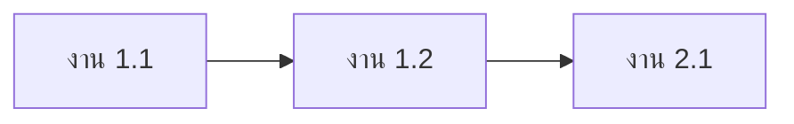

# โครงสร้างการแบ่งงานและรอบการทำงาน

| รายการ | รายละเอียด |
|---|---|
| รหัสเอกสาร | WBS-XXX-001 |
| ฉบับแก้ไขครั้งที่ | 00 |
| วันที่มีผลบังคับใช้ | YYYY-MM-DD |
| สถานะ | ร่าง / รอทบทวน / อนุมัติแล้ว |
| เอกสารอ้างอิง | REQ-XXX-001 rev NN · EST-XXX-001 rev NN |
| ผู้จัดทำ | [ชื่อ] |

---

## 1. หลักการแบ่งงาน

1.1 **แบ่งตามคุณค่าที่ส่งมอบได้ ไม่ใช่ตามชั้นเทคนิค** — "ทำ API ทั้งหมด"
แล้วค่อย "ทำหน้าจอทั้งหมด" แปลว่าไม่มีอะไรใช้ได้จนกว่าทั้งสองจะเสร็จ
และไม่มีทางรู้ว่าช้าจนกระทั่งสายเกินไป

1.2 งานหนึ่งชิ้นต้องเล็กพอที่จะเสร็จภายในหนึ่งรอบ งานที่ประมาณแล้วเกินนั้น ต้องแตกต่อ

1.3 ทุกงานต้องสาวกลับไปหารหัสข้อกำหนดได้ งานที่สาวกลับไม่ได้คือขอบเขตที่งอกเอง

---

## 2. โครงสร้างการแบ่งงาน

| รหัสงาน | งาน | รหัสข้อกำหนดที่รองรับ | ปริมาณงาน | ขึ้นกับงานไหน |
|---|---|---|---|---|
| 1 | [กลุ่มงาน] | — | — | — |
| 1.1 | [งานย่อย] | — | — | — |
| 1.2 | — | — | — | — |
| 2 | — | — | — | — |

---

## 3. ลำดับก่อนหลังและเส้นทางวิกฤต

3.1 งานที่ต้องเสร็จก่อนงานอื่นถึงจะเริ่มได้

| งาน | ต้องเสร็จก่อน | เพราะอะไร |
|---|---|---|
| — | — | — |

3.2 เส้นทางที่ยาวที่สุด — งานบนเส้นทางนี้ล่าช้าหนึ่งวัน โครงการล่าช้าหนึ่งวัน

3.3 งานที่มีเวลาเผื่อ และเผื่อได้กี่วัน

---

## 4. การแบ่งเป็นรอบการทำงาน

| รอบ | ช่วงเวลา | เป้าหมายของรอบ (หนึ่งประโยค) | งานที่รับปาก | งานสำรอง |
|---|---|---|---|---|
| 1 | — | — | — | — |
| 2 | — | — | — | — |

**เป้าหมายของรอบต้องเป็นหนึ่งประโยคที่บอกว่ารอบนี้ทำให้อะไรเป็นจริง**
ไม่ใช่รายการงานที่จะทำ

---

## 5. รายการที่ตกลงจะตัดถ้าไม่ทัน

ตกลงล่วงหน้า ไม่ใช่ไปตัดตอนเหลือสามวัน — ตอนนั้นทุกอย่างจะดูสำคัญเท่ากันหมด

| ลำดับที่จะตัด | งาน | ผลกระทบเมื่อตัด | ใครต้องรู้ |
|---|---|---|---|
| 1 | — | — | — |

---

## 6. หมุดหมาย

| หมุดหมาย | วันที่ | เกณฑ์ว่าถึงแล้วจริง |
|---|---|---|
| — | — | — |

หมุดหมายที่ไม่มีเกณฑ์ คือวันที่ที่ทุกคนตีความต่างกัน

---

## 7. สิ่งที่ต้องพึ่งพาจากภายนอก

| รายการ | ขึ้นกับใคร | ต้องได้เมื่อไหร่ | ถ้าไม่ได้จะกระทบงานไหน |
|---|---|---|---|
| — | — | — | — |

---

## 8. ประวัติการแก้ไข

| ฉบับที่ | วันที่ | ข้อที่แก้ | สาระสำคัญ | เหตุผล |
|---|---|---|---|---|
| 00 | YYYY-MM-DD | — | ฉบับแรก | — |
