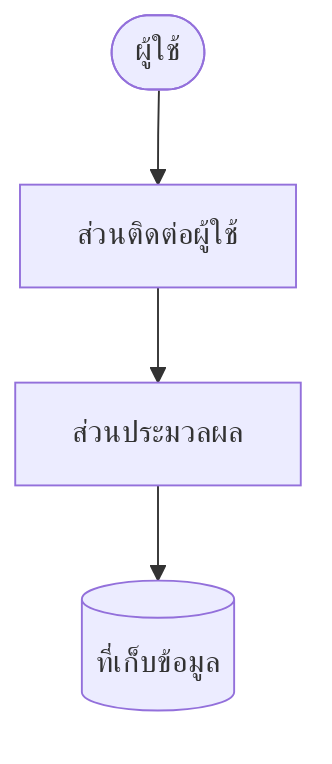

# สถาปัตยกรรมระบบ

| รายการ | รายละเอียด |
|---|---|
| รหัสเอกสาร | ARC-XXX-001 |
| ฉบับแก้ไขครั้งที่ | 00 |
| วันที่มีผลบังคับใช้ | YYYY-MM-DD |
| สถานะ | ร่าง / รอทบทวน / อนุมัติแล้ว |
| เอกสารอ้างอิง | SRS-XXX-001 rev NN · REQ-XXX-001 rev NN |
| ผู้จัดทำ | นักวิเคราะห์ระบบ |

---

## 1. ขอบเขต

1.1 เอกสารฉบับนี้ครอบคลุมการตัดสินใจเชิงโครงสร้างของระบบ

1.2 สิ่งที่ไม่ครอบคลุม และอยู่ที่เอกสารไหนแทน

---

## 2. เกณฑ์การตัดสินใจ

**เขียนเกณฑ์ก่อนดูทางเลือก** เกณฑ์ที่เขียนหลังจากเลือกแล้ว คือคำอธิบายเหตุผลย้อนหลัง
ไม่ใช่การตัดสินใจ

| ลำดับ | เกณฑ์ | มาจากข้อกำหนดข้อไหน | น้ำหนัก |
|---|---|---|---|
| 1 | — | — | — |
| 2 | — | — | — |

ข้อกำหนดที่ไม่ใช่หน้าที่ระดับ "ต้องมี" ต้องปรากฏในตารางนี้ครบทุกข้อ

---

## 3. ภาพรวมสถาปัตยกรรม

| ส่วนประกอบ | หน้าที่ | เทคโนโลยี | ทำไมต้องมี |
|---|---|---|---|
| — | — | — | — |

---

## 4. การตัดสินใจเชิงสถาปัตยกรรม

ทำสำเนาหัวข้อนี้หนึ่งชุดต่อหนึ่งการตัดสินใจ หรือแยกเป็นไฟล์ตาม `adr-template.md`

### ADR-01 · [หัวข้อการตัดสินใจ]

| รายการ | รายละเอียด |
|---|---|
| สถานะ | เสนอ / ตัดสินแล้ว / ถูกแทนที่ด้วย ADR-NN |
| วันที่ | YYYY-MM-DD |
| บริบท | อะไรบังคับให้ต้องตัดสินใจข้อนี้ |

**ทางเลือกที่พิจารณา** — ต้องมีอย่างน้อยสองทาง ทางเลือกเดียวไม่ใช่การตัดสินใจ

| ทางเลือก | ข้อดี | ข้อเสีย | ผลตามเกณฑ์ข้อ 2 |
|---|---|---|---|
| ก | — | — | — |
| ข | — | — | — |

**เลือกอะไร และเพราะอะไร**

**สิ่งที่ต้องแลก** — ทุกทางเลือกมีต้นทุน ถ้าเขียนไม่ออกแปลว่ายังไม่เข้าใจทางเลือกนั้น

**ทางที่ปฏิเสธ และเงื่อนไขที่จะกลับมาพิจารณาใหม่**

---

## 5. การจัดเก็บข้อมูล

5.1 ข้อมูลอยู่ที่ไหน — เครื่องผู้ใช้ เครื่องแม่ข่าย หรือทั้งสอง

5.2 ถ้าอยู่ทั้งสองที่ ต้องตอบสามข้อนี้ให้ครบ

| คำถาม | คำตอบ |
|---|---|
| ซิงค์เมื่อไหร่ | — |
| ข้อมูลชนกันแล้วยึดฝั่งไหน | — |
| ใช้งานตอนไม่มีเน็ตได้แค่ไหน | — |

**"ยึดฝั่งที่แก้ล่าสุด" ไม่ใช่คำตอบที่สมบูรณ์** ต้องระบุว่านาฬิกาของใครเป็นตัวตัดสิน
และเกิดอะไรขึ้นเมื่อสองเครื่องแก้คนละช่องของรายการเดียวกัน

5.3 การสำรองและกู้คืน

---

## 6. ความปลอดภัย

| ด้าน | วิธีจัดการ | ข้อกำหนดที่รองรับ |
|---|---|---|
| การพิสูจน์ตัวตน | — | — |
| การกำหนดสิทธิ์ | — | — |
| ข้อมูลระหว่างส่ง | — | — |
| ข้อมูลที่เก็บไว้ | — | — |
| ข้อมูลส่วนบุคคล | — | — |

---

## 7. การตรวจสอบข้อกำหนดที่ไม่ใช่หน้าที่ทีละข้อ

ตรวจทีละข้อ ไม่ใช่ตรวจรวม — การตรวจรวมทำให้ข้อที่สถาปัตยกรรมนี้รองรับไม่ได้ หายไปเงียบ ๆ

| รหัส NFR | ข้อกำหนด | สถาปัตยกรรมนี้รองรับยังไง | พิสูจน์ได้ยังไง |
|---|---|---|---|
| — | — | — | — |

---

## 8. สมมติฐาน

| ข้อ | สมมติฐาน | ถ้าไม่จริงจะกระทบอะไร | ใครยืนยันได้ |
|---|---|---|---|
| — | — | — | — |

## 9. ประเด็นที่ยังไม่ได้ข้อยุติ

| ข้อ | ประเด็น | บล็อกงานอะไร |
|---|---|---|
| — | — | — |

---

## 10. ประวัติการแก้ไข

| ฉบับที่ | วันที่ | ข้อที่แก้ | สาระสำคัญ | เหตุผล |
|---|---|---|---|---|
| 00 | YYYY-MM-DD | — | ฉบับแรก | — |
