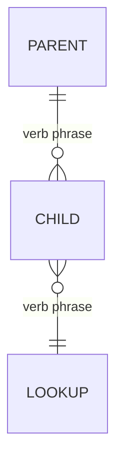

# Data model — [system name]

| รายการ | รายละเอียด |
|---|---|
| รหัสเอกสาร | DM-XXX-001 |
| ฉบับแก้ไขครั้งที่ | 00 |
| วันที่มีผลบังคับใช้ | YYYY-MM-DD |
| สถานะ | ร่าง / รอทบทวน / อนุมัติแล้ว |
| เอกสารอ้างอิง | [PRD-XXX-001 rev NN · SRS-XXX-001 rev NN] |
| ผู้จัดทำ | นักวิเคราะห์ระบบ |
| Schema version described | [1] |

---

## 1. Conceptual model

Entities and relationships in business language. No keys, no types. A domain
expert must be able to read this and correct it.



Cardinality notation: `||--o{` one-to-many · `}o--o{` many-to-many ·
`||--||` one-to-one · `|o` optional side.

## 2. Entity dictionary

Repeat this block per entity.

### 2.1 [ENTITY_NAME]

**Purpose** — one sentence. What fact about the world this records.

**Key** — [attribute] ([type]; opaque, stable; client-generatable? yes/no and why)

| Attribute | Type | Null | Default | Constraint | Notes |
|---|---|---|---|---|---|
| | | | | | |

**Relationships**

| Related entity | Cardinality | On parent delete | Notes |
|---|---|---|---|
| | | cascade / restrict / set null | |

**Uniqueness** — [attributes] unique within [scope].

**Lifecycle** — created when […]; mutable fields […]; terminal state […];
hard-deleted? [never / when].

**Immutability** — attributes frozen after creation: […].

**Traces to** — [requirement IDs]

An entity with nothing on the "Traces to" line is scope creep. Delete it or
justify it.

## 3. Definition vs execution separation

| Definition entity | Execution entity | What is snapshotted into the execution record | Why |
|---|---|---|---|
| | | | Editing the definition must not rewrite history |

## 4. Temporal rules

| Rule | Statement |
|---|---|
| Timestamp storage | [UTC, with originating timezone stored separately where local meaning matters] |
| Day boundary | [user-configured offset; default …] |
| Recurrence storage | [anchor + rule, not a materialised occurrence list] |
| Derived date logic | [state the formula] |

```
[position / occurrence formula, written out]
```

Edge cases this rule must survive: [list — see references/test-design.md §3].

## 5. Constraints not enforceable by the UI

Anything the schema must enforce because an import, a migration, or a second
client will otherwise violate it.

| Constraint | Enforced by | Requirement |
|---|---|---|
| | | |

## 6. Capacity

| Entity | Rows/user | Calculation | Bytes/row (est.) | Bytes/user |
|---|---|---|---|---|
| | | | | |

**Total per user:** [rows] ≈ [MB] against a stated budget of [ ].

**Assumptions:** [retention period, active-day ratio, row-size basis].

### 6.1 Query shapes

| Read | Frequency | Index | Expected cost |
|---|---|---|---|
| | | | indexed lookup / range scan / full scan |

Any frequent read that is a full scan at stated capacity is a design defect.

## 7. Schema versioning and migration

**Version field:** [name, stored with the data, not inferred from app version]

| From | To | Change | Destructive? | Data movement |
|---|---|---|---|---|
| 1 | 2 | | additive / destructive | |

**Migration rules**

- Runs before any read of user data
- Idempotent; safe to re-run after interruption
- On failure: source data untouched, nothing partially written, user informed,
  retry possible
- On downgrade: a newer schema version is detected and writes are refused
  rather than corrupting
- Tested from **every** previously shipped version, not only the last

## 8. Extensibility check against deferred requirements

| Deferred req | Statement | Does the model block it? | How it stays open |
|---|---|---|---|
| | | no | |

"Extensible" means this table, not the adjective.

## 9. Physical model

Tables/collections, types as they exist in the chosen store, indexes, and any
denormalization with the measured reason for it.

| Index | On | Supports | Justification |
|---|---|---|---|
| | | | |

| Denormalization | Duplicated from | Why | Rebuild / invalidation rule |
|---|---|---|---|
| | | | |

## 10. Review checklist

- [ ] Every entity traces to at least one requirement
- [ ] Definition and execution separated wherever the user can edit both
- [ ] Every relationship has cardinality and a delete rule
- [ ] Every attribute has type, nullability, and constraint
- [ ] Primary keys opaque and stable; client-generatable if created offline
- [ ] Uniqueness rules stated with scope
- [ ] Schema version present, migration path defined and tested from all prior versions
- [ ] Time fields specify UTC vs local and any day-boundary rule
- [ ] Capacity computed in rows and bytes against the stated budget
- [ ] Each frequent read is an indexed lookup at stated capacity
- [ ] Each deferred requirement checked against the model
- [ ] Deletion and export paths exist where required by law or requirements
