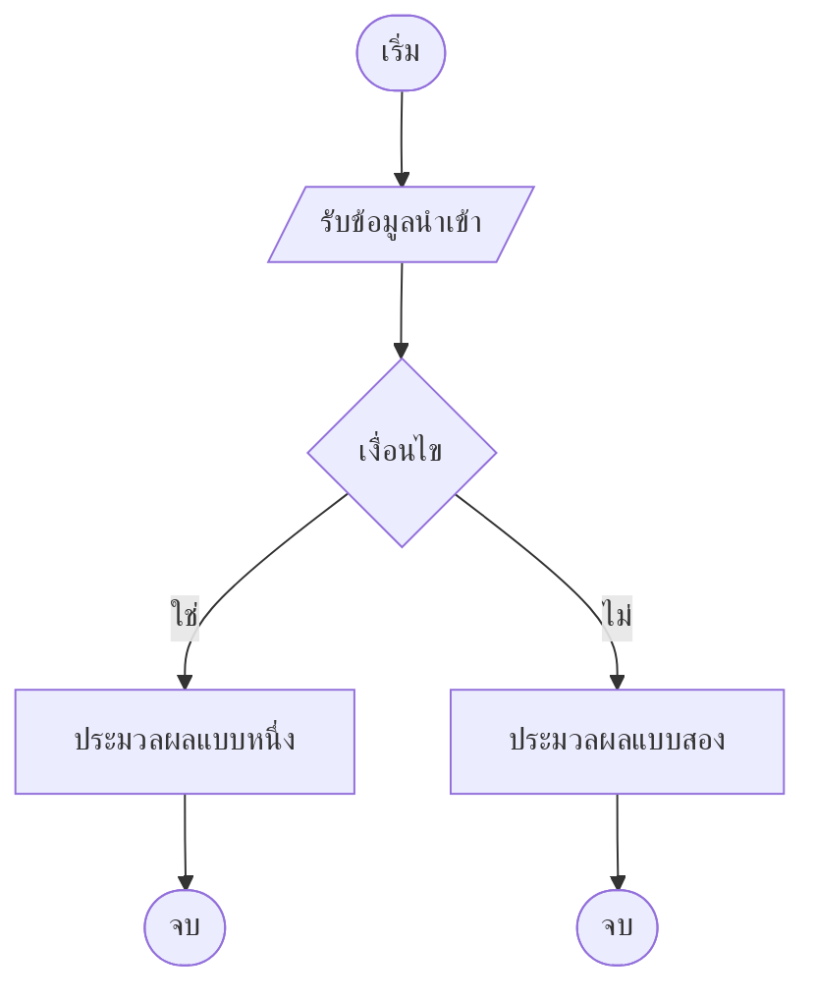

# ข้อกำหนดกลไกเฉพาะ

| รายการ | รายละเอียด |
|---|---|
| รหัสเอกสาร | DAY-XXX-001 |
| ฉบับแก้ไขครั้งที่ | 00 |
| วันที่มีผลบังคับใช้ | YYYY-MM-DD |
| สถานะ | ร่าง / รอทบทวน / อนุมัติแล้ว |
| เอกสารอ้างอิง | SRS-XXX-001 rev NN |
| ผู้จัดทำ | นักวิเคราะห์ระบบ |

---

## เมื่อไหร่ควรมีเอกสารฉบับนี้

เมื่อมีกลไกที่กฎซับซ้อนเกินกว่าจะฝังไว้ในเอกสารข้อกำหนดหลัก และผิดแล้วผู้ใช้เจอ
ทันที — การคำนวณวันและรอบเวลา · การคิดราคาและส่วนลด · การจัดคิวหรือจองที่ทับกันได้
· การให้สิทธิ์แบบมีเงื่อนไขซ้อนกัน

ถ้ากลไกเขียนจบได้ในสามย่อหน้า มันไม่ต้องมีเอกสารของตัวเอง ให้อยู่ใน SRS

---

## 1. ปัญหาที่กลไกนี้แก้

1.1 กลไกนี้ตอบคำถามอะไรให้ระบบ

1.2 ผิดแล้วเกิดอะไรกับผู้ใช้

---

## 2. นิยามที่ต้องตกลงก่อน

คำที่ทุกคนคิดว่าเข้าใจตรงกันแต่ไม่ตรงกัน คือที่มาของข้อบกพร่องส่วนใหญ่ในกลไกแบบนี้

| คำ | นิยามที่ใช้ในเอกสารนี้ | สิ่งที่ *ไม่ใช่* |
|---|---|---|
| — | — | — |

ตัวอย่างคำที่ต้องนิยาม — "วันแรก" นับจากวันสมัครหรือวันเริ่มใช้งาน
· "วันนี้" ใช้เขตเวลาของใคร · "สัปดาห์" เริ่มวันจันทร์หรือวันอาทิตย์

---

## 3. ข้อมูลนำเข้าและผลลัพธ์

| ข้อมูลนำเข้า | ชนิด | มาจากไหน | ค่าที่เป็นไปได้ |
|---|---|---|---|
| — | — | — | — |

| ผลลัพธ์ | ชนิด | ความหมาย |
|---|---|---|
| — | — | — |

---

## 4. กฎ

เขียนเป็นข้อ ๆ ที่ทดสอบได้ทีละข้อ ไม่ใช่ย่อหน้าบรรยาย

| รหัสกฎ | กฎ | เมื่อขัดกับกฎข้ออื่น ยึดข้อไหน |
|---|---|---|
| R-01 | — | — |
| R-02 | — | — |

**ลำดับความสำคัญของกฎ** — เมื่อกฎสองข้อใช้ได้พร้อมกัน ต้องระบุว่ายึดข้อไหน
ไม่ใช่ปล่อยให้ลำดับในโค้ดเป็นตัวตัดสิน

---

## 5. ผังการทำงาน

ใช้สัญลักษณ์ตาม ISO 5807 · แต่ละกิ่งจบที่จุดสิ้นสุดของตัวเอง
ห้ามลากเส้นยาวมารวมที่จุดเดียว

| ป้ายในผัง | ชื่อทางเทคนิค |
|---|---|
| — | — |

---

## 6. กรณีขอบ

หัวข้อนี้คือเหตุผลที่เอกสารฉบับนี้มีอยู่ กลไกแบบนี้พังที่กรณีขอบเสมอ ไม่ใช่ที่กรณีปกติ

| รหัส | กรณี | ผลที่ถูกต้อง | ทำไมถึงยาก |
|---|---|---|---|
| E-01 | ข้ามเที่ยงคืน | — | — |
| E-02 | ข้ามเดือน | — | — |
| E-03 | ปีอธิกสุรทิน | — | — |
| E-04 | เขตเวลาต่างกัน | — | — |
| E-05 | ค่าที่ขอบพอดี | — | — |
| E-06 | ค่าว่างหรือไม่มีข้อมูล | — | — |

ลบแถวที่ไม่เกี่ยวกับกลไกนี้ออก แต่**อย่าลบเพราะยังคิดไม่ออก**

---

## 7. ตารางตัวอย่างที่คำนวณแล้ว

ตัวอย่างที่คำนวณด้วยมือแล้ว ใช้เป็นข้อมูลทดสอบได้ทันที

| ลำดับ | ข้อมูลนำเข้า | ผลลัพธ์ที่ถูกต้อง | กฎข้อที่ใช้ |
|---|---|---|---|
| 1 | — | — | — |

---

## 8. การสอบทานย้อนกลับ

| รหัสข้อกำหนด | กฎที่รองรับ | กรณีทดสอบใน TST-XXX-001 |
|---|---|---|
| — | — | — |

---

## 9. ประวัติการแก้ไข

| ฉบับที่ | วันที่ | ข้อที่แก้ | สาระสำคัญ | เหตุผล |
|---|---|---|---|---|
| 00 | YYYY-MM-DD | — | ฉบับแรก | — |
