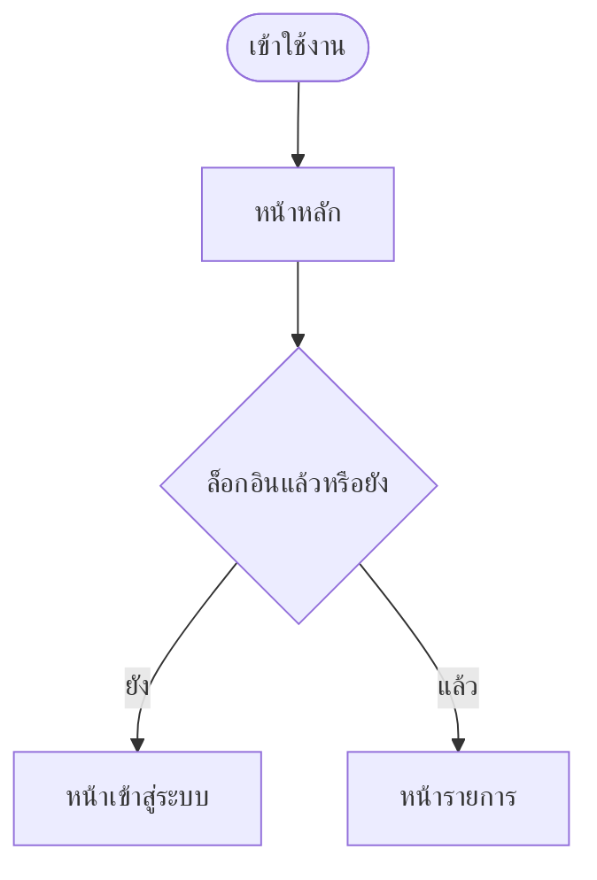

# ผังการไหลของหน้าจอ ฉบับเชิงตรรกะ

| รายการ | รายละเอียด |
|---|---|
| รหัสเอกสาร | NAV-XXX-001 |
| ฉบับแก้ไขครั้งที่ | 00 |
| วันที่มีผลบังคับใช้ | YYYY-MM-DD |
| สถานะ | ร่าง / รอทบทวน / อนุมัติแล้ว |
| เอกสารอ้างอิง | SRS-XXX-001 rev NN · REQ-XXX-001 rev NN |
| ผู้จัดทำ | นักวิเคราะห์ระบบ |

**เชิงตรรกะ แปลว่าอธิบายว่าผู้ใช้ไปไหนได้บ้างและเมื่อไหร่ ไม่ใช่หน้าตา**
หน้าตาอยู่ใน `DSN-XXX-001` · เอกสารนี้เขียนได้ตั้งแต่ยังไม่มีแบบหน้าจอ

---

## 1. ขอบเขต

1.1 ครอบคลุมหน้าจอไหนบ้าง

1.2 หน้าจอที่รู้ว่าต้องมีแต่ยังระบุไม่ได้ และติดอะไรอยู่

---

## 2. รายการหน้าจอ

| รหัสหน้า | ชื่อหน้า | หน้าที่ | ข้อกำหนดที่รองรับ | ต้องล็อกอินไหม |
|---|---|---|---|---|
| S-01 | — | — | — | — |

---

## 3. ผังการไหลหลัก

ป้ายในผังเขียนเป็นภาษาคน ชื่อทางเทคนิคใส่ในตารางเทียบใต้ผัง
· ใช้สัญลักษณ์ตาม ISO 5807 ดูตารางในskill `document-control`

| ป้ายในผัง | รหัสหน้า | ชื่อทางเทคนิค |
|---|---|---|
| — | — | — |

---

## 4. สถานะของแต่ละหน้า

**หน้าที่ระบุแต่สถานะปกติ คือหน้าที่ยังไม่ได้ออกแบบ** สถานะที่ลืมบ่อยที่สุด
คือหน้าที่ยังไม่มีข้อมูล และหน้าที่ผู้ใช้ไม่มีสิทธิ์

### S-01 · [ชื่อหน้า]

| สถานะ | เกิดเมื่อไหร่ | ผู้ใช้เห็นอะไร | ไปต่อที่ไหนได้ |
|---|---|---|---|
| มีข้อมูล | — | — | — |
| ยังไม่มีข้อมูล | — | — | — |
| กำลังโหลด | — | — | — |
| ผิดพลาด | — | — | — |
| ไม่มีสิทธิ์ | — | — | — |
| ไม่มีเน็ต | — | — | — |

---

## 5. เส้นทางที่ผู้ใช้เดินจริง

อธิบายเป็นเรื่องเล่า ไม่ใช่รายการหน้าจอ — ให้เห็นว่าผู้ใช้กำลังพยายามทำอะไร

### 5.1 [ชื่อเส้นทาง เช่น จองห้องซ้อมครั้งแรก]

| ขั้น | ผู้ใช้ทำอะไร | ระบบตอบอะไร | หน้าไหน | ข้อกำหนดข้อไหน |
|---|---|---|---|---|
| 1 | — | — | — | — |

**จุดที่เส้นทางนี้ล้มเหลวได้**

| จุด | เกิดอะไร | ผู้ใช้ไปต่อยังไง |
|---|---|---|
| — | — | — |

---

## 6. การย้อนกลับและการออก

| จากหน้า | ปุ่มย้อนกลับพาไปไหน | ปิดกลางคันแล้วข้อมูลหายไหม |
|---|---|---|
| — | — | — |

ข้อนี้ถูกลืมเกือบทุกครั้ง และเป็นที่มาของข้อบกพร่องที่ผู้ใช้เจอบ่อยที่สุด

---

## 7. ส่วนที่ยังส่งมอบไม่ได้

| ส่วน | ติดอะไร | ต้องได้อะไรจึงจะทำต่อได้ |
|---|---|---|
| — | — | — |

---

## 8. การสอบทานย้อนกลับ

| รหัสข้อกำหนด | หน้าจอที่รองรับ | เกณฑ์การยอมรับที่เกี่ยวข้อง |
|---|---|---|
| — | — | — |

---

## 9. ประวัติการแก้ไข

| ฉบับที่ | วันที่ | ข้อที่แก้ | สาระสำคัญ | เหตุผล |
|---|---|---|---|---|
| 00 | YYYY-MM-DD | — | ฉบับแรก | — |
