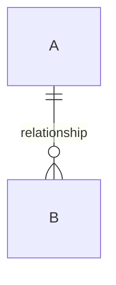

# [System name] — System Requirements and Design Specification

| รายการ | รายละเอียด |
|---|---|
| รหัสเอกสาร | SRS-XXX-001 |
| ฉบับแก้ไขครั้งที่ | 00 |
| วันที่มีผลบังคับใช้ | YYYY-MM-DD |
| สถานะ | ร่าง / รอทบทวน / อนุมัติแล้ว |
| เอกสารอ้างอิง | [PRD-XXX-001 rev NN · REQ-XXX-001 rev NN] |
| ผู้จัดทำ | นักวิเคราะห์ระบบ |

---

## 1. Purpose and scope

1.1 What this document specifies, and for whom.

1.2 What it deliberately does not cover, and where that lives instead.

1.3 Requirement IDs in this document are taken unchanged from [source document,
section N]. Any inconsistency found is reported as a defect against that
document and is not corrected here.

## 2. Source material and intake

### 2.1 Documents received

| # | Code | Title | Revision | Date received |
|---|---|---|---|---|
| | | | | |

### 2.2 Decided — designed against

| Ref | Decision | Source |
|---|---|---|
| | | |

### 2.3 Open, not blocking

| Ref | Question | Assumption used | Impact if the assumption is wrong |
|---|---|---|---|
| | | | |

### 2.4 Open and blocking

| Ref | Question | Blocks | Why it blocks | Owner |
|---|---|---|---|---|
| | | | | |

### 2.5 Conflicts found in the source material

| # | Requirements in conflict | Nature of the conflict | Impact | Proposed resolution | Status |
|---|---|---|---|---|---|
| | | | | | |

Conflicts are reported, not resolved unilaterally. Each requires a revision of
the source document before the affected design is final.

## 3. Requirement inventory

| ID | Statement | Priority | In this pass | AC count | Notes |
|---|---|---|---|---|---|
| | | | | | |

Deferred requirements are listed with the reason. The data model must not block
them; section 4.5 records how each is kept open.

## 4. Data model

### 4.1 Conceptual model

### 4.2 Entity dictionary

For each entity: purpose, key, attributes with types and constraints,
relationships with cardinality and delete rules, lifecycle, uniqueness, and the
requirements it traces to. See `data-model-template.md`.

### 4.3 Capacity

| Entity | Rows per user | Basis |
|---|---|---|
| | | |

Total per user: [rows] ≈ [bytes]. Stated budget: [ ]. Headroom: [ ].

### 4.4 Schema versioning and migration

Version field, migration mechanism, failure behaviour, and which upgrade paths
are tested.

### 4.5 Deferred requirements — extensibility check

| Deferred req | Would it change the schema? | How it stays open |
|---|---|---|
| | | |

## 5. Architecture

### 5.1 Overview

Diagram and one paragraph. What runs where, what crosses a network.

### 5.2 Decisions

| ADR | Decision | Status |
|---|---|---|
| | | |

Full records in `adr/`. Each states the options considered and why the rejected
ones were rejected.

### 5.3 Verification against must-have requirements

| Req | How the architecture satisfies it | Verdict |
|---|---|---|
| | | PASS / PASS, unverified / FAIL |

"PASS, unverified" means the design is sound but the claim has not been
measured. Name the outstanding measurement.

### 5.4 Failure behaviour

| Failure | Behaviour | Recoverable |
|---|---|---|
| | | |

## 6. Behaviour specification

### 6.1 Business rules

| ID | Rule | Traces to |
|---|---|---|
| BR-01 | | |

### 6.2 Use cases

Main flow plus alternate flows, per use case.

### 6.3 State models

State machines for every entity with a status, plus the screen-state grid.

### 6.4 Screen flow

Navigation graph including entry conditions and every state the requirements
name.

### 6.5 Error catalogue

| Code | Cause | User sees | System does | Recoverable | Traces to |
|---|---|---|---|---|---|
| | | | | | |

## 7. Interfaces

Contracts for every boundary. See `interface-contract-template.md`.

## 8. Non-functional requirements as design constraints

| NFR | Source | Design constraint | How it is verified |
|---|---|---|---|
| | | | |

Every adjective from the source documents appears here converted into a number
and a measurement method, or is listed in section 2.4 as unresolved.

## 9. Test approach

Technique selection, data sets, and the coverage rule applied. Test cases in
`test-cases/`, matrix in `traceability.md`.

## 10. Revised estimate

| Work package | Prior estimate | Revised | Δ | Reason for the change |
|---|---|---|---|---|
| | | | | |

Basis of the revision: the design in sections 4–7, not judgement. Say which
design element drove each change.

## 11. Assumptions

| ID | Assumption | Because | If wrong | Owner | By when |
|---|---|---|---|---|---|
| | | | | | |

## 12. Open questions

| # | Question | Blocks | Owner | Needed by |
|---|---|---|---|---|
| | | | | |

## 13. Revision history

| Rev | Date | Sections changed | Substance and reason | Impact on scope, effort, metrics | Author |
|---|---|---|---|---|---|
| 00 | | All | First issue | — | |
