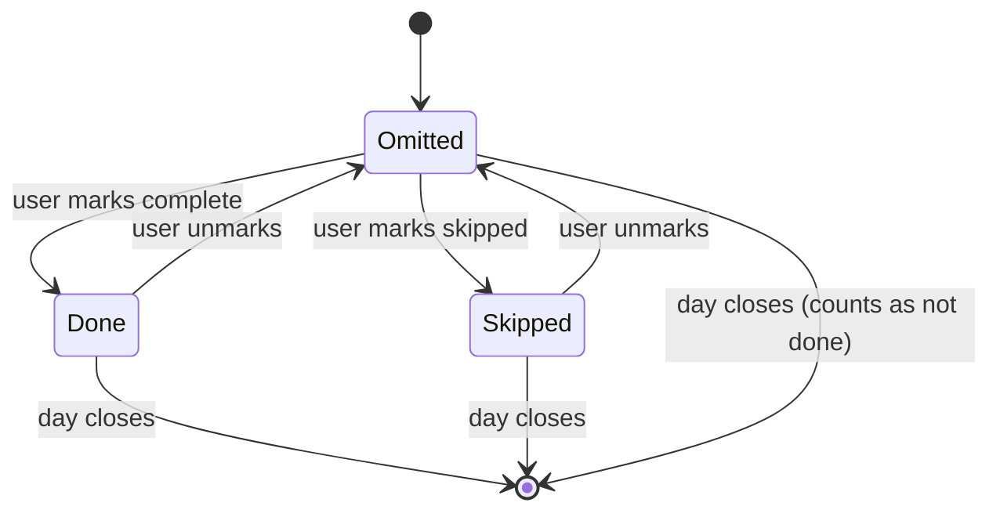
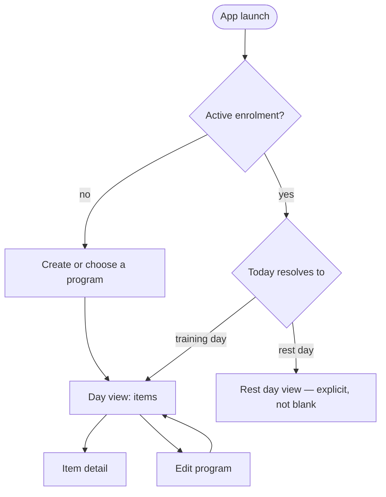
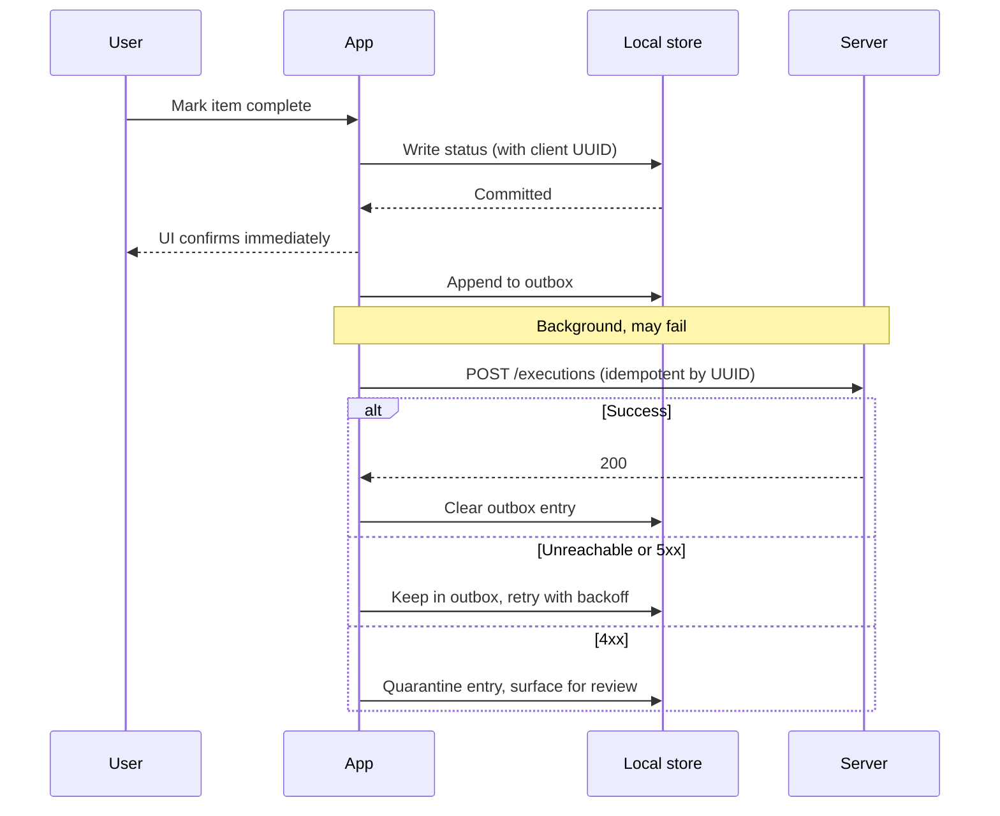

# Behaviour and interface specification

Turning a data model and a set of requirements into something a developer can
implement without guessing, and a tester can check without asking.

---

## 1. Use cases

A use case is the actor's goal plus every way it can go wrong. The alternate
flows are the content; the main flow is usually obvious.

```
UC-03  Record completion of a prescribed item
Actor        User following an active program
Trigger      User taps an item on the day view
Precondition An enrolment is active and today resolves to a training day
Guarantee    On success, the item's status is persisted locally before the UI
             confirms it

Main flow
  1. User selects the item
  2. System writes status = done with today's effective date
  3. System updates the remaining-items count
  4. System advances the next incomplete item into view
  5. If all items are complete, system records day-complete

Alternate flows
  A1  Item already done      → status returns to omitted, no confirmation prompt
  A2  Local write fails      → UI reverts, error names the cause and the action
  A3  Storage full           → write refused, user told what to free, data intact
  A4  Day rolls over mid-set → effective date uses the day-start rule, not
                               wall-clock midnight
  A5  No network             → identical behaviour; sync queued silently

Traces to    S2, S2.1–S2.4
```

Alternate flow A4 is the kind that only appears if someone enumerates
deliberately. Most defects live in the alternates.

---

## 2. State models

Any entity with a status field needs a state machine. Draw it, and check every
state is both reachable and leaveable.



Check for:
- **Unreachable states** — specified but nothing transitions into them
- **Trap states** — nothing transitions out; usually a missing recovery path
- **Missing transitions** — the requirement says a user can undo; does every
  state have the reverse edge?
- **Semantically distinct states collapsed** — "not done yet" and "deliberately
  skipped" are different facts, and statistics must not merge them. If the
  requirements distinguish them, the model must too.

### Screen and UI states

Requirements documents usually enumerate the states a screen must handle;
implementations usually cover three of them. List every screen against every
state and fill the grid.

| Screen | Empty / first run | Loading | Error | Offline | Expired entitlement | Max data |
|---|---|---|---|---|---|---|
| Day view | Route to setup, never a blank page | Should not occur — local read; if seen, it's a defect | Cause + fix, never a bare code | Normal operation, no banner | Read-only, nothing deleted | Paginated, stays in budget |
| Program editor | … | … | … | … | … | … |

A cell you can't fill is a specification gap; report it rather than guessing.
Note that "loading should not occur" is itself a testable statement — it turns
a design principle into a check.

---

## 3. Screen flow

Map navigation as a graph, including the entry conditions that route users
somewhere other than the default.



Rules:
- Every node needs a way back. A screen a user can enter and not leave is a bug
  drawn as a diagram.
- Deep links and app resume are entry points too — specify where a cold launch
  from a notification lands.
- Cover the states from section 2 as routing conditions, not as decorations on
  a screen.

---

## 4. Sequence diagrams for cross-boundary work

Use these where components interact and ordering matters — writes, sync, auth,
payments. The value is in showing what happens when a participant doesn't
answer.



If the `alt` block is missing from a sequence diagram, the diagram is
documenting the demo, not the system.

---

## 5. Interface contracts

For every boundary — HTTP API, storage layer, third-party integration — specify
before implementation. See `assets/interface-contract-template.md`.

Per operation:

| Element | Must state |
|---|---|
| Purpose | What it does, in one line |
| Request | Every field, type, required/optional, constraints |
| Response | Success shape, status code |
| Errors | Every error case with code, meaning, and whether the client retries |
| Idempotency | Key and semantics — mandatory for anything a client retries |
| Auth | What's required, what happens when it's missing or expired |
| Timeout | Client timeout and what the client does when it fires |
| Rate limits | Limit, window, and the client's backoff behaviour |
| Versioning | How a breaking change is introduced without breaking old clients |
| Traces to | Requirement IDs |

Two rules that prevent most integration pain:

- **Idempotency is not optional** for any write a client can retry, and every
  offline-capable client retries. The key is the client-generated record ID.
- **Specify the timeout case explicitly.** "The server didn't answer" is the
  most common runtime state and the one least often designed for. It is not the
  same as an error response.

---

## 6. Error catalogue

One table, all errors, referenced from everywhere else. Anonymous errors become
"something went wrong" in the UI, which tells the user nothing and the support
team less.

| Code | Cause | User sees | System does | Recoverable | Traces to |
|---|---|---|---|---|---|
| E-STORE-01 | Local write failed | "Couldn't save. Your data is unchanged. Try again." + retry | Revert optimistic UI, log, keep prior state | Yes | S2, 11.9.1 |
| E-STORE-02 | Device storage full | "Storage is full. Free space to keep saving." + how much | Refuse write, keep all existing data | Yes, by user action | 11.8.2 |
| E-SYNC-01 | Server unreachable | Nothing | Queue, exponential backoff | Automatic | S3 |
| E-SYNC-02 | Rejected as invalid (4xx) | Silent until it persists, then a review prompt | Quarantine, stop retrying, log | Manual | — |
| E-MIGR-01 | Schema migration failed | "Update couldn't finish. Your data is safe." + retry | Keep old data intact, block writes, log version | Yes | 11.10.4 |

Rules: never show a bare error code with no cause; never claim data was lost
unless it was; never leave a state where the only action is to force-quit.

---

## 7. Business rules, stated separately from the UI

Rules that hold regardless of which screen is open belong in their own numbered
list, because they need their own tests and they outlive every screen.

```
BR-01  The program day is computed from the enrolment start date and the
       effective date, where the effective date applies the user's configured
       day-start offset.
BR-02  A rest day is a position within the cycle, not an absence of one.
BR-03  "Skipped" and "not yet done" are distinct and are never merged in any
       statistic.
BR-04  A day counts as complete only when every prescribed item for that day
       has a terminal status.
BR-05  Editing a program never alters any already-recorded execution.
```

Each rule gets a unit test that does not need a UI. If a rule can only be
tested by driving screens, the logic is in the wrong layer — which is a design
finding worth reporting.
