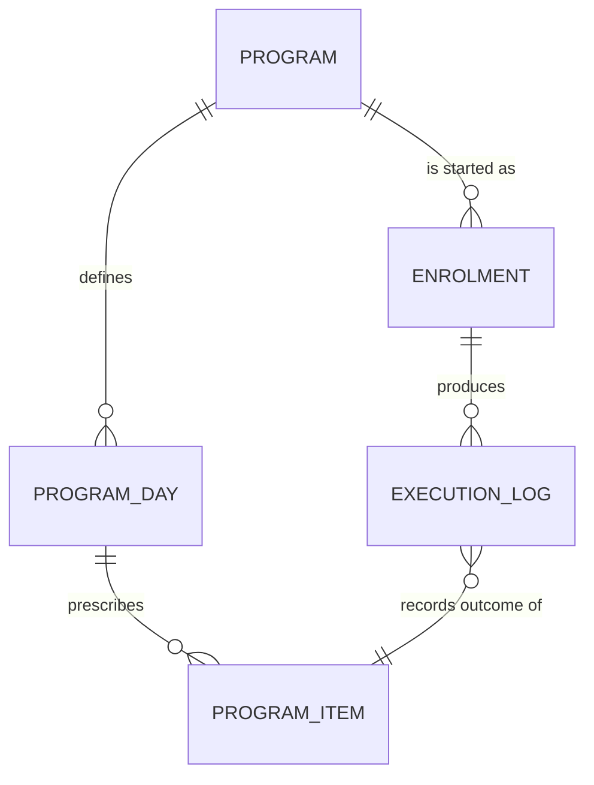

# Data modeling

The data model is the most expensive artifact to change and the cheapest to
think hard about. Everything downstream — queries, sync, migration, test data,
half the bugs — is nailed to it.

---

## 1. Three levels, in order

**Conceptual** — entities and relationships in the language of the business.
No keys, no types. The test: a domain expert can read it and say "no, a plan
can have many cycles" without knowing what a foreign key is.

**Logical** — keys, attributes, types, constraints, cardinality, normalization.
Still storage-neutral.

**Physical** — tables or collections, indexes, denormalization for real query
shapes, storage engine specifics.

Do not skip to physical. Half the modelling mistakes are decisions about
storage made before the domain was understood.

---

## 2. The separation that matters most

**Definition and execution are different entities.** A program, plan,
template, schedule, or recipe describes intent. What actually happened is a
separate record.

Collapse them and editing yesterday's plan rewrites yesterday's history. Users
experience this as data loss and are correct to.



The rule generalises: any time a user can *edit the thing* and also *have done
the thing*, that's two entities. Menu and order. Shift pattern and timesheet.
Curriculum and transcript.

A related consequence: the execution record should capture enough of the
definition to remain readable if the definition is later edited or deleted.
Either snapshot the fields that matter, or make definitions immutable and
version them.

---

## 3. Keys

- **Every entity gets a stable, opaque primary key** generated at creation.
  Not an email, not a name, not a position in a list, not a composite of
  business fields — all of those change, and changing a key means rewriting
  every reference to it.
- **UUIDs when records are created offline or on multiple devices.** Sequential
  server-assigned IDs cannot be generated by a disconnected client, so an
  offline-capable system needs client-generatable keys. Decide this at the
  model stage; retrofitting it is a data migration.
- **Natural keys become unique constraints**, not primary keys. Email is a
  uniqueness rule, not an identity.
- **Composite keys only for genuine join tables**, and even then a surrogate
  key is usually cheaper once the join table acquires attributes — which it
  always does.
- **Write down what "owns" what.** Deleting a parent either cascades, restricts,
  or orphans. Pick per relationship and record it; the default in your database
  is not a decision anyone made.

---

## 4. Constraints belong in the schema

Anything enforced only by the UI will eventually be violated by an import, a
migration, a second client, or a retry. For each attribute record:

| Property | Example |
|---|---|
| Type and precision | `decimal(6,2)`, not "number" |
| Nullable | Explicit yes/no with a reason if yes |
| Default | Explicit; "none" is also explicit |
| Range / domain | `1..14`, or an enumerated set |
| Uniqueness | Scope of uniqueness — global, per user, per parent |
| Referential rule | Cascade / restrict / set null on parent delete |
| Mutability | Immutable after creation? Write it down |

Nullable columns deserve suspicion. A nullable field usually means either
"this is really two entities" or "we don't know what it means when it's
absent." Both are worth resolving before shipping.

---

## 5. Time, recurrence, and cycles

Anything computing one date from another is where the subtle bugs live. Specify
the rule before writing code.

**What to store:**
- Store an anchor (start date/time) plus a rule, not a materialised list of
  every occurrence. A materialised list is wrong the moment the rule changes.
- Store timestamps in UTC with the originating time zone recorded separately
  when local wall-clock meaning matters. "9am every day" and "14:00 UTC" are
  different requirements and only one of them survives travel.
- Store the user's configured day boundary if there is one. "Today" is not
  midnight for everyone — a workout finished at 00:30 usually belongs to the
  previous day.

**The day-of-cycle calculation** — the archetypal case:

```
elapsed      = days_between(program_start_date, effective_today)
cycle_length = number of days in one cycle
position     = (elapsed mod cycle_length) + 1
```

where `effective_today` applies the configured day-start offset before
computing the date. Every one of the following changes the answer and must be
in the test suite:

| Case | Why it breaks |
|---|---|
| Day-start offset (e.g. 03:00) | 00:30 belongs to the previous program day |
| Month boundary | Naive day arithmetic on day-of-month |
| Year boundary | Same, plus year rollover in any cached key |
| Leap day | 29 Feb exists; day counts shift |
| Time zone change while travelling | Local date jumps forward or back |
| DST forward | A day with 23 hours |
| DST backward | A day with 25 hours and a repeated local hour |
| Device clock moved backwards | `elapsed` goes negative |
| Start date in the future | Position must be defined, not negative |
| Rest days inside the cycle | Position ≠ index into the training-day list |

Two structural notes: rest days are days in the cycle, not gaps between them —
model the cycle as an ordered list of days each typed training or rest. And
if the product supports both cyclic ("repeat every 6 days") and
calendar-based ("Mon/Wed/Fri") programs, that's one entity with a schedule
*type* discriminator, not two parallel entity trees. Deciding this late is
expensive; deciding it in the model is nearly free.

---

## 6. Schema versioning and migration

Ship this in v1. Retrofitting it is the most common cause of the data loss
everyone promised was impossible.

**Minimum viable versioning:**
- A `schema_version` stored with the data, not inferred from the app version.
- A migration function per version step, applied in order, idempotent.
- Migration runs before any read of user data, at startup.
- On failure: keep the old data intact, do not partially write, tell the user,
  and let them retry. Never delete the source until the target is verified.
- On rollback (user installs an older build): detect a future schema version
  and refuse to write rather than corrupt.

**Test the migration path from every previously shipped version to current**,
not just from the immediately preceding one. Users skip versions.

**Additive changes are cheap; destructive ones are not.** Adding a nullable
column or a new table needs no data movement. Renaming, retyping, splitting, or
merging does. When a change is destructive, the migration writes to the new
shape, verifies, then removes the old — in that order, ideally across two
releases.

**Extensibility is specific, not general.** "The model should be extensible"
means nothing. "Requirement S7 (skip/defer a day) is deferred, so the execution
log carries a nullable `deferred_from_date` and the cycle position is computed
rather than stored" is a design that doesn't block a known future requirement.
List the deferred requirements and check the model against each.

---

## 7. Capacity drives the physical model

Turn the capacity requirements into row counts before choosing indexes.

Worked example, from a stated capacity table:

```
30 items/day × 300 active days/year × 3 years history = 27,000 execution rows/user
8 meals/day × 365 days × 3 years                      =  8,760 meal rows/user
20 programs × 14 days × 30 items                      =  8,400 definition rows/user
                                                        ────────
                                                        ~44,000 rows/user
```

At ~200 bytes/row that's ~9 MB — comfortably inside a 20 MB/user budget, on a
local store, with room for indexes. That single calculation answers "can this
live on the device?" and it takes two minutes.

What the numbers then decide:
- **Query shape** — "today's items" must be one indexed lookup, not a scan of
  27,000 rows. Index on `(user, date)` or `(enrolment, date)`.
- **History queries** — "last 7 and last 30 days" are range scans on the same
  index; no separate structure needed.
- **Pagination** — needed above roughly a few thousand rows in one view.
- **Aggregate storage** — only if a computed metric is too slow to derive; a
  stored counter is a cache and needs an invalidation rule.

If the requirements state no capacity, derive it from usage frequency and get
the number confirmed. Designing against "some" produces a model that works at
demo scale.

---

## 8. Normalize, then denormalize on evidence

Normalize to 3NF by default: no repeating groups, no partial dependencies, no
transitive dependencies. Then denormalize only where a *measured* query needs
it, and record why in the model documentation — otherwise the next person
"fixes" it back.

The two denormalizations that are usually justified in a local-first system:

- **Snapshotting definition fields into execution records**, so history stays
  readable after a plan is edited (section 2).
- **A per-day rollup for streak or adherence counters**, when computing them
  from raw rows on every launch would blow the launch-time budget. Specify how
  it's rebuilt if it drifts.

---

## 9. Entity dictionary format

For each entity, this much and no less:

```
Entity: EXECUTION_LOG
Purpose: Records that a prescribed item was completed, skipped, or omitted
         on a specific date by a specific enrolment.
Key:     execution_id (UUID, client-generatable)

| Attribute        | Type          | Null | Constraint                        |
|------------------|---------------|------|-----------------------------------|
| execution_id     | uuid          | no   | PK                                |
| enrolment_id     | uuid          | no   | FK → ENROLMENT, restrict on delete|
| program_item_id  | uuid          | yes  | FK → PROGRAM_ITEM, set null       |
| item_snapshot    | json          | no   | Name/target at time of execution  |
| effective_date   | date          | no   | Program day, after day-start rule |
| status           | enum          | no   | done | skipped | omitted           |
| recorded_at      | timestamptz   | no   | UTC; device clock                 |
| schema_version   | int           | no   | Current version at write time     |

Relationships: ENROLMENT 1..* EXECUTION_LOG
               PROGRAM_ITEM 0..* EXECUTION_LOG
Lifecycle:     Created when the user marks an item; status may change; never
               hard-deleted — a reversal sets status back to omitted.
Uniqueness:    (enrolment_id, program_item_id, effective_date)
Traces to:     S2, S2.2, S2.4, S5.3, S6
```

The `Traces to` line is not decoration. An entity with nothing in it is scope
creep and should be deleted or justified.

---

## 10. Model review checklist

- [ ] Every entity traces to at least one requirement
- [ ] Definition and execution are separate entities where the user can edit both
- [ ] Every relationship has stated cardinality and a delete rule
- [ ] Every attribute has type, nullability, and constraint
- [ ] Primary keys are opaque and stable; client-generatable if created offline
- [ ] Uniqueness rules stated with their scope
- [ ] `schema_version` present and a migration path defined
- [ ] Time fields specify UTC vs local, and any day-boundary rule
- [ ] Capacity computed in rows and bytes per user, against the stated budget
- [ ] Query shape for each frequent read is an indexed lookup, not a scan
- [ ] Each deferred requirement checked: does the model block it?
- [ ] Deletion and export paths exist if the law or the requirements demand them
