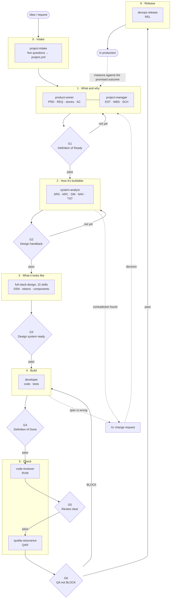

# Workflow

How the 24 skills form a single pipeline, what each gate checks, and what the
roles hand to each other.

---

## The flow



**The dotted lines are the parts most pipelines are missing** — the change-request
loop, and measuring the real outcome against the number the PRD promised. Without
them the pipeline only moves forward, and nobody ever learns whether it was right.

---

## Each role answers a different question

| Role | Answers | Delivers | Succeeds when |
|---|---|---|---|
| `project-intake` | **What do we already know** | project.yml | Nobody is asked the same thing twice |
| `product-owner` | **What, and why** | PRD REQ TRN | The team builds the right thing |
| `project-manager` | **How, and when** | EST WBS SCH | It ships on time with nobody surprised |
| `system-analyst` | **How is it buildable** | SRS ARC DM NAV TST | Developers start without guessing |
| `full-stack-design` | **What does it look like** | DSN, tokens, components | Every screen agrees, and everyone can use it |
| `developer` | **Is it done** | code, tests | It matches the spec and can be reviewed |
| `code-reviewer` | **Should this code land** | RVW | The next person can change it safely |
| `quality-assurance` | **Is it ready to ship** | QAR | What passes does not come back as a defect |
| `devops-release` | **May it go live now** | REL | If it must be rolled back, it can be |
| `document-control` | **Which revision am I reading** | the register | Nobody reads a stale document unknowingly |

**The short version** — subject matter is PO · time, people and risk is PM ·
structure and data is SA · appearance is design · code is dev · code quality is
reviewer · does it match the spec is QA · may it ship is release.

---

## The six gates

Run with `/gate`, which reads the actual files and records the result in
`project.yml`.

| Gate | From → to | Question | Criteria live in |
|---|---|---|---|
| G1 | PO → SA | Are the requirements ready to design against | `product-owner`, Definition of Ready |
| G2 | SA → design/dev | Does every design element trace to a requirement | `system-analyst/assets/design-handback-checklist.md` |
| G3 | design → dev | Is the design system ready to code against | `/gate`, section G3 |
| G4 | dev → review | Is it done, or did you just stop typing | `developer/assets/definition-of-done.md` |
| G5 | review → QA | Should this code land | `code-reviewer`, merge decision |
| G6 | QA → release | May it ship | `devops-release/assets/release-checklist.md` |

**G4 and G5 are the two gates most teams do not have**, despite being the cheapest
to run and the ones that catch the most. Almost everyone has a Definition of
Ready; almost nobody has a Definition of Done.

---

## How work is handed over

**Two channels** — `project.yml` is shared memory; documents are the formal
deliverables.

```
project.yml   Every role reads it before starting, writes back what it learns
              → nobody gets asked the same question twice
              → the TBDs an earlier role left behind are visible

Documents     Registered in REGISTER.md, with a code and a revision number
              → you always know which revision you are reading
              → requirement IDs stay traceable end to end
```

**The traceability chain** is what holds it together:

```
requirement → design → screen → test case → code
```

Every arrow must walk in both directions. A component with no requirement behind
it is scope that grew on its own. A requirement with no test is a hope. Code that
cannot say which requirement it implements is code nobody dares delete.

---

## When something goes wrong

| Situation | Do this | Never do this |
|---|---|---|
| Source documents contradict each other | `/cr`, then keep working on a declared assumption | Pick one silently · edit the source document yourself |
| The estimate changes after design | Tell the PM the moment you know | Save it for the next status report |
| A gate fails | Fix what is missing, run `/gate` again | Advance `stage` by hand |
| QA returns BLOCK | Send it back to development | Ship it and fix it later |
| A release breaks production | Restore service first, diagnose second | Debug in production while users are affected |
| The schedule slips | Measure the gap, find the cause, offer three options, rebaseline once | Rebaseline every week |

---

## Three layers, and what each one enforces

| ชั้น | อยู่ที่ไหน | บังคับอะไรได้ |
|---|---|---|
| **skill** | `.claude/skills/` 26 ตัว | ความรู้และวิธีทำงานของแต่ละบทบาท |
| **subagent** | `.claude/agents/` 11 บทบาท | **การแยกคอนเท็กซ์และการจำกัดเครื่องมือ** |
| **correcter** | `tools/correcter/` | **การตัดสินว่างานใช้ได้หรือไม่** |

**สิ่งที่ subagent ให้และ skill ให้ไม่ได้ คือการแยกคอนเท็กซ์**

ตอนที่ทุกบทบาทอยู่ในคอนเท็กซ์เดียว ผู้ทบทวนโค้ดเห็นเหตุผลทั้งหมดที่ผู้เขียนใช้
แล้วถูกเหตุผลนั้นโน้มน้าว · การทบทวนที่เห็นเจตนาของผู้ถูกทบทวน ไม่ใช่การทบทวน

**และสิ่งที่ allowlist ของเครื่องมือให้ คือการบังคับกติกาด้วยโครงสร้าง**

| บทบาท | ไม่มีเครื่องมืออะไร | บังคับกติกาข้อไหน |
|---|---|---|
| `code-reviewer` | `Edit` `Write` | ผู้ทบทวนไม่แก้โค้ด รายงานก่อน |
| `quality-assurance` | `Edit` `Write` | ผู้ตรวจคุณภาพไม่เขียนฟีเจอร์ |

สองข้อนี้เคยเป็นคำสั่งใน `CLAUDE.md` ที่ต้องอาศัยวินัย ตอนนี้เครื่องมือไม่มีให้ใช้
และมีตัวตรวจ `AGT-01` เฝ้าอยู่ว่าไม่มีใครเติมกลับเข้าไป

**แต่ต้องพูดตรงๆ ว่ามันไม่ใช่กรงที่ปิดสนิท** — `Bash` เขียนไฟล์ได้ด้วย redirect
และการทบทวนที่ได้ผลจริงต้องเปิดเซิร์ฟเวอร์แล้วยิงคำขอ ซึ่งต้องใช้ `Bash`
ไม่มี allowlist ชุดไหนที่ทั้งให้ตรวจสอบได้อิสระ และห้ามเขียนไฟล์พร้อมกัน

ขอบเขตนี้จึงเป็นสองอย่างประกอบกัน — เครื่องมือแก้ไฟล์ที่ไม่มีให้ใช้
กับข้อห้ามที่เขียนไว้ในตัว agent · **หนักแน่นกว่าวินัยล้วน แต่ไม่ใช่การกันที่พิสูจน์ได้**

## Running the whole thing autonomously

`orchestrator` เดินสายงานทั้งหมดโดยไม่ถาม แล้วส่งผลให้ `correcter` ตัดสินว่าใช้ได้หรือไม่

```
เลือกระยะ → ทำงานของบทบาท → บันทึกการตัดสินใจ → python3 tools/correcter/verify.py
    รหัส 0  PASS       เลื่อนระยะ วนต่อ
    รหัส 1  CORRECTED  รันคำสั่งแก้ แล้วตรวจซ้ำ
    รหัส 2  BLOCKED    หยุด รายงาน ห้ามหาทางอ้อม
```

**ตัวที่ทำงาน ไม่ใช่ตัวที่รับรองงาน** — `correcter` เป็นโค้ดที่ตัดสินแบบกลไก
ไม่อ่านเจตนา ไม่ชั่งน้ำหนักเหตุผล และโน้มน้าวไม่ได้

ข้ออ้างทุกข้อถูกจำแนกสามชั้น · `VERIFIED` มีความจริงให้เทียบและตรง ·
`ASSERTED` ยังไม่มีความจริงให้เทียบ · `CONTRADICTED` มีให้เทียบแต่ไม่ตรง

**ข้ออ้างชั้น `ASSERTED` ที่ค้ำประตูอยู่ ทำให้ทั้งระบบ BLOCKED** เช่นท่าออกกำลังกาย
ที่ยังไม่มีผู้เชี่ยวชาญรับรอง · ระบบอัตโนมัติเติมค่าแทนคนไม่ได้ และไม่ควรได้

## Principles every skill shares

1. **Deliver the work, not a description of how you would do the work.**
2. **Never invent what you do not know** — write `TBD — ต้องการ [คน/ข้อมูล]`.
3. **Make assumptions visible**, and say which numbers are guesses.
4. **You may decide on the user's behalf, but you must say so** — one line at the
   end, so it can be overruled.
5. **Never certify your own work** — the thing that produces the work does not
   get to say whether it is correct. That is `correcter`'s job, and it is code.
6. **Report the problem rather than quietly fixing it** — each stage earns its
   place by catching things early, not by being clever about repairs.
