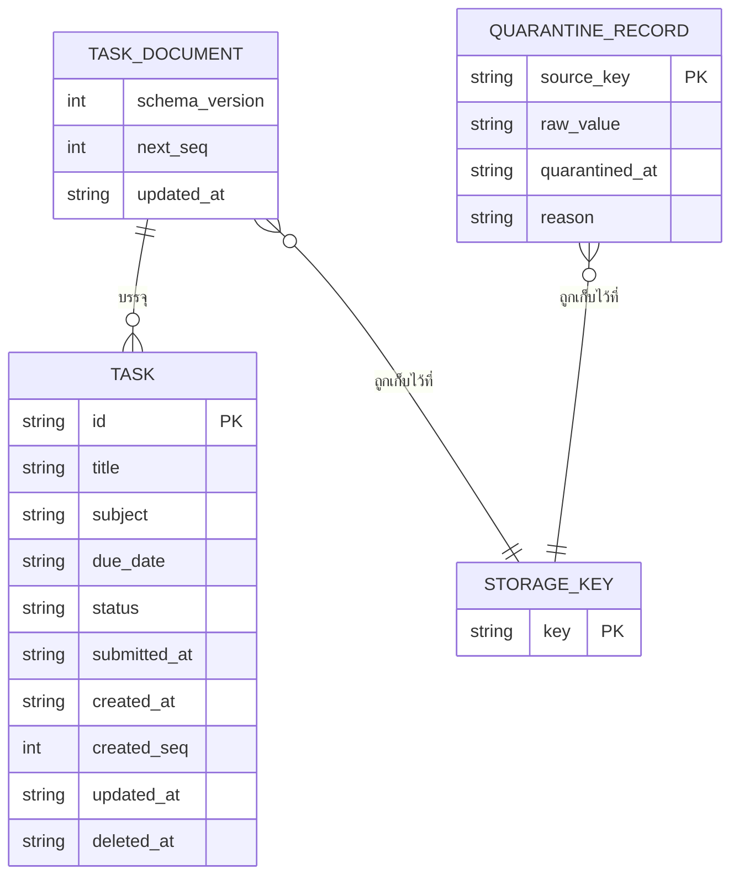
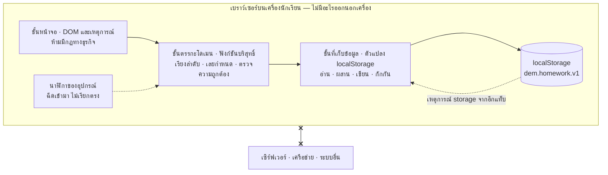

# เตือนการบ้าน — ข้อกำหนดระบบและข้อกำหนดการออกแบบ

| รายการ | รายละเอียด |
|---|---|
| รหัสเอกสาร | SRS-DEM-001 |
| ฉบับแก้ไขครั้งที่ | 00 |
| วันที่มีผลบังคับใช้ | 2026-09-15 |
| สถานะ | ร่าง |
| เอกสารอ้างอิง | PRD-DEM-001 ฉบับ 01 (มีผล 2026-09-14) · `project/project.yml` (อ่านเมื่อ 2026-09-15) |
| ผู้จัดทำ | นักวิเคราะห์ระบบ |

> **ข้อค้นพบ F-01 — เอกสารฉบับนี้ถูกออกใหม่ ไม่ใช่เขียนขึ้นจากศูนย์**
> `project/REGISTER.md` ลงแถว `SRS-DEM-001` ฉบับ 00 ไว้แล้วตั้งแต่ 2026-09-14 และ
> `project.yml` มีรายการใน `open_questions` และ `assumptions` ที่อ้าง "SRS-DEM-001 rev 00"
> (O-01…O-03, CONF-01…CONF-07, CONF-09, A-01…A-08, ADR-05) รวมทั้ง `gates: G2 attempt 2`
> บันทึกว่าตรวจพบไฟล์นี้แล้ว **แต่ไฟล์ไม่มีอยู่ในโครงการเมื่อเริ่มเขียนฉบับนี้**
> เอกสารฉบับนี้จึงออกเป็นฉบับ 00 ลงวันที่ 2026-09-15 และ **ใช้รหัสเดิมทุกตัว**
> เพื่อให้การอ้างอิงใน `project.yml` ยังชี้ถูกที่ · ดูข้อ 13
> สิ่งที่ยังพิสูจน์ไม่ได้คือเนื้อหาของฉบับ 00 เดิมตรงกับฉบับนี้หรือไม่ — ไม่มีสำเนาให้เทียบ

---

## 1. วัตถุประสงค์และขอบเขตของเอกสาร

### 1.1 เอกสารนี้กำหนดอะไร และเพื่อใคร

เอกสารนี้แปลงข้อกำหนดใน `PRD-DEM-001` ฉบับ 01 ให้เป็นสิ่งที่ **สร้างได้และพิสูจน์ได้** —
แบบจำลองข้อมูล การตัดสินใจเชิงสถาปัตยกรรมพร้อมทางเลือกที่ปฏิเสธ กฎทางธุรกิจ
สถานะและเส้นทางหน้าจอ สัญญาที่ขอบเขตระบบ บัญชีข้อผิดพลาด และกรณีทดสอบ
ผู้อ่านคือผู้พัฒนาและผู้ทดสอบที่จะลงมือในระยะถัดไป

### 1.2 เอกสารนี้จงใจไม่ครอบคลุมอะไร

| ไม่ครอบคลุม | อยู่ที่ไหนแทน |
|---|---|
| ตัดสินว่าจะสร้างอะไรและทำไม | `PRD-DEM-001` — บทบาท product-owner |
| แผนงาน ลำดับงาน วันที่ ประมาณการที่ผูกกับปฏิทิน | บทบาท project-manager |
| ภาพหน้าจอ สี ตัวอักษร ระยะห่าง องค์ประกอบ | ระยะออกแบบ — ยังไม่มีไฟล์แบบ (`quality.design_reference` เป็น TBD) |
| โค้ดจริง | ระยะสร้าง |

**ข้อสำคัญ** — ข้อ 6.4 (เส้นทางหน้าจอ) เขียนได้เฉพาะระดับ *สถานะและเงื่อนไขการเข้า* เท่านั้น
เพราะยังไม่มีไฟล์แบบและยังไม่รู้อุปกรณ์เป้าหมาย การเขียนเลย์เอาต์ลงไปในเอกสารนี้
จะเป็นการประดิษฐ์หน้าจอที่ไม่มีใครสั่ง

### 1.3 วินัยเรื่องรหัส

รหัส `US-xx` และ `AC-xx.x` ในเอกสารนี้ **คัดมาจาก `PRD-DEM-001` ข้อ 7.1 ตรงตัว**
ไม่เรียงใหม่ ไม่รวบ ไม่แก้ให้สวย ความไม่สอดคล้องที่พบถูกรายงานเป็นข้อบกพร่องของเอกสารต้นทาง
ในข้อ 2.5 และ **ไม่ถูกแก้ในเอกสารนี้**

รหัสที่เอกสารนี้ออกเอง มีเฉพาะ `BR-xx` (กฎทางธุรกิจ) `ERR-xx` (ข้อผิดพลาด)
`TC-xx` (กรณีทดสอบ) `ADR-xx` (บันทึกการตัดสินใจเชิงสถาปัตยกรรม) `SC-xx` (หน้าจอ)
`O-xx` (คำถามค้าง) `A-xx` (ข้อสมมติ) `CONF-xx` (ข้อขัดแย้ง) `F-xx` (ข้อค้นพบเรื่องเอกสาร)
ทั้งหมดไม่ทับกับรหัสของเอกสารต้นทาง

---

## 2. เอกสารต้นทางและการรับงาน

### 2.1 เอกสารที่ได้รับ

| # | รหัส | ชื่อ | ฉบับ | วันที่มีผล | วันที่อ่าน |
|---|---|---|---|---|---|
| 1 | PRD-DEM-001 | เตือนการบ้าน — เอกสารข้อกำหนดผลิตภัณฑ์ | 01 | 2026-09-14 | 2026-09-15 |
| 2 | — | `project/project.yml` | ไม่มีหมายเลขฉบับ (ดู A-08) | — | 2026-09-15 |
| 3 | — | `project/REGISTER.md` | ปรับปรุง 2026-09-14 | — | 2026-09-15 |

**ไม่ได้รับ** — เหตุผลเบื้องหลังการตัดสินของ product-owner, บทสัมภาษณ์ผู้ใช้,
ค่าฐานของตัวชี้วัด, ไฟล์แบบ, ประมาณการเดิม เอกสารนี้ออกแบบจากสิ่งที่เขียนไว้เท่านั้น

**ข้อค้นพบเรื่องความสอดคล้องของฉบับ**

| # | ข้อค้นพบ | ผลกระทบ |
|---|---|---|
| F-01 | ทะเบียน `REGISTER.md` และ `gates: G2 attempt 2` ยืนยันว่า `SRS-DEM-001` ฉบับ 00 มีอยู่ แต่ไฟล์ไม่มีจริง | ประตู G2 ที่ผ่านเมื่อ 2026-09-14 อ้างหลักฐานที่ตรวจซ้ำไม่ได้ · ต้องให้ผู้ตรวจประตูรันซ้ำกับไฟล์ฉบับนี้ |
| F-02 | `project.yml` อ้าง `CONF-01…CONF-07` และ `CONF-09` แต่ **ไม่มี `CONF-08`** ขณะที่ `REGISTER.md` เขียนว่า "ข้อขัดแย้ง 9 ข้อ" | ข้อขัดแย้ง 1 ข้อเคยถูกบันทึกในเอกสารแต่ไม่เคยถูกลงใน `project.yml` · ฉบับนี้ตั้ง CONF-08 ขึ้นใหม่ (ข้อ 2.5) และเพิ่มรายการใน `open_questions` |
| F-03 | `project.yml` ไม่มีหมายเลขฉบับ จึงตรวจเทียบกับ "ฉบับวันที่ 2026-09-12" ที่ PRD อ้างตรง ๆ ไม่ได้ | บันทึกเป็นข้อสมมติ A-08 |

### 2.2 ตัดสินแล้ว — ออกแบบบนสิ่งนี้

| อ้างอิง | สิ่งที่ตัดสินแล้ว | ที่มา |
|---|---|---|
| D-01 | ข้อมูลอยู่บนเครื่องผู้ใช้เท่านั้น ใน localStorage ไม่มีฐานข้อมูลฝั่งเซิร์ฟเวอร์ | `technical.data_location` (VERIFIED) · PRD ข้อ 9 |
| D-02 | HTML/CSS/JavaScript ล้วน ไม่ใช้เฟรมเวิร์ก | `technical.stack` (VERIFIED) · PRD ข้อ 9 |
| D-03 | ไม่มีบัญชีผู้ใช้ ไม่มีการเข้าสู่ระบบ | PRD ข้อ 5.1 |
| D-04 | ไม่ซิงก์ข้ามเครื่อง | PRD ข้อ 5.2 |
| D-05 | ไม่มีการแจ้งเตือนแบบ push / ไลน์ / อีเมล / SMS | PRD ข้อ 5.3 |
| D-06 | ไม่แนบไฟล์หรือรูป | PRD ข้อ 5.5 |
| D-07 | ภาษาไทยภาษาเดียว | PRD ข้อ 5.7 |
| D-08 | ไม่มีมุมมองปฏิทินรายเดือน/รายสัปดาห์ — รอบนี้เป็นรายการเรียงตามวันส่ง | PRD ข้อ 5.8 (ดู A-05) |
| D-09 | WCAG 2.1 ระดับ AA | `quality.wcag: AA` (VERIFIED) |
| D-10 | ไม่มีข้อผูกพันตามกฎหมายที่ประกาศไว้ — `invariants: []` | `project.yml` (VERIFIED) |
| D-11 | ขอบเขตรอบนี้คือ US-01…US-04 (Must) และ US-05 (Should) · รายการ Could ไม่อยู่ในรอบนี้ | PRD ข้อ 7 |

> **เตือน** — D-01 และ D-02 เป็นวิธีแก้ที่เจ้าของโครงการเลือกมาก่อนวิเคราะห์ปัญหา
> (บันทึกไว้ใน `assumptions` ของ `project.yml` และ PRD ข้อ 9) เอกสารนี้ออกแบบตามนั้น
> แต่ไม่ได้ยืนยันว่าเป็นทางเลือกที่ดีที่สุด — ดู ADR-01 ที่ชั่งทางเลือกภายใต้ข้อจำกัดนี้

### 2.3 เปิดอยู่ แต่ไม่ขวางงาน

ทำงานต่อได้ด้วยข้อสมมติที่ประกาศไว้ ถ้าข้อสมมติผิด ผลกระทบอยู่ในคอลัมน์ขวาสุด

| อ้างอิง | คำถาม | ข้อสมมติที่ใช้ | ถ้าข้อสมมติผิดจะกระทบอะไร |
|---|---|---|---|
| **O-01** | ช่อง "วิชา" บังคับกรอกหรือไม่ · PRD มีเกณฑ์ยอมรับเส้นทางผิดพลาดสำหรับ *ชื่องาน* ว่าง (AC-01.4) แต่ไม่มีข้อใดพูดถึง *วิชา* ว่าง ขณะที่ AC-01.2 เขียนว่า "กรอกครบทั้งสาม" | **A-01** — ไม่บังคับกรอก | BR-01, ERR-02, TC-04 กลับด้าน · ต้องเพิ่มข้อความผิดพลาดและย้ายโฟกัสในแบบฟอร์ม |
| **O-02** | ช่อง "วันกำหนดส่ง" ว่างได้หรือไม่ ถ้าว่างได้ต้องอยู่ตำแหน่งใดในลำดับ | **A-02** — บังคับกรอก | BR-03, BR-04, TC-08 · ถ้าว่างได้ ต้องนิยามตำแหน่งในลำดับและสถานะ "เลยกำหนด" ของงานที่ไม่มีวัน ซึ่งไม่มีเกณฑ์ยอมรับรองรับเลย |
| **O-03** | เส้นแบ่งวันของคำว่า "เลยกำหนด" คือเวลาใด เขตเวลาใด | **A-03** — วันตามปฏิทินท้องถิ่นของอุปกรณ์ เส้นแบ่ง 00:00 น. | ผลคาดหวังของ TC-10 และ TC-31…TC-36 เปลี่ยนทั้งชุด · BR-05 ต้องเขียนใหม่ · กระทบการนับ M1 |
| **O-10** | "งานที่ส่งแล้ว" ยังต้องถูกเก็บถาวรหรือมีการเก็บกวาดเมื่อจบปีการศึกษา | **A-09** — เก็บไว้ตลอด ไม่มีการเก็บกวาดอัตโนมัติ (ตามคำสัญญาใน PRD ข้อ 9) | ข้อ 4.3 ความจุ · ถ้ามีการเก็บกวาด ต้องมีกฎและเกณฑ์ยอมรับซึ่งยังไม่มี |

### 2.4 เปิดอยู่ และขวางงาน

หัวข้อในคอลัมน์ "ขวางอะไร" **เว้นไว้จริงในเอกสารนี้** ไม่ได้เติมด้วยการเดา

| อ้างอิง | คำถาม | ขวางหัวข้อไหน | ทำไมถึงขวาง | ผู้ต้องตอบ |
|---|---|---|---|---|
| **O-04** | ความจุที่ต้องรองรับ — งานกี่รายการต่อผู้ใช้ PRD ไม่ระบุไว้เลย | **ข้อ 4.3** (ปิดไม่ได้) · **ADR-01** (ปิดไม่ได้) · **TC-39** (ไม่มีเกณฑ์ผ่าน) | ความจุเป็นตัวตัดสินว่าเก็บทั้งเอกสารในคีย์เดียวได้หรือไม่ ถ้าจำนวนรายการโตกว่าที่ประมาณมาก การเขียนทั้งก้อนทุกครั้งจะแพงและชนโควตา | เจ้าของโครงการ |
| **O-05** | งบประมาณสมรรถนะ — เวลาที่ยอมรับได้ตั้งแต่เปิดหน้าจนรายการแสดงครบ | **ข้อ 8** (แถว NFR-02 ว่าง) · สถานะหน้าจอ "กำลังโหลด" ใน 6.3 ไม่มีเกณฑ์ · **TC-39** | AC-01.2 เขียนว่า "ทันที" ซึ่งไม่ใช่ข้อกำหนดจนกว่าจะมีตัวเลขและวิธีวัด · ผูกกับ `design.devices` และ `quality.browsers` ที่ยังเป็น TBD | เจ้าของโครงการ (PRD ข้อ 9) |
| **O-06** | ต้องใช้งานตอนไม่มีเน็ตหรือไม่ และปล่อยขึ้นที่ไหน | **ADR-05** (ยังไม่ตัดสิน) · สถานะหน้าจอ "ออฟไลน์" ใน 6.3 · **ข้อ 7 IF-04** | วิธีส่งมอบตัวแอป (ไฟล์เดี่ยว / โฮสต์นิ่ง / PWA) ตัดสินไม่ได้เลยถ้าไม่รู้ว่าต้องเปิดได้ตอนไม่มีเน็ตไหม และมันเปลี่ยนว่ามีไฟล์อะไรต้องแคชบ้าง | เจ้าของโครงการ (`technical.offline`, `release.target`) |
| **O-07** | ความยาวสูงสุดของชื่องานและชื่อวิชา | **BR-12** · **ERR-06** · **TC-30** (เขียนได้แต่รันไม่ได้) | AC-05.5 อ้าง "ความยาวสูงสุดที่กำหนด" ที่ไม่มีใครกำหนด · เกณฑ์ที่ไม่มีตัวเลขคือเกณฑ์ที่ทดสอบไม่ได้ | เจ้าของโครงการ (PRD §7.1 US-05) |
| **O-08** | อุปกรณ์เป้าหมายและเบราว์เซอร์ที่รองรับ | **ข้อ 4.3** (โควตา localStorage จริง) · **ข้อ 6.4** (รายละเอียดเส้นทางหน้าจอ) · **ข้อ 8** NFR-03 | โควตา localStorage ต่างกันตามเบราว์เซอร์ · ขนาดพื้นที่กดและการวางปุ่มขึ้นกับอุปกรณ์ | เจ้าของโครงการ (`design.devices`, `quality.browsers`) |
| **O-09** | ใครลงมือทำ กี่คน และประมาณการเดิมคือเท่าไร | **ข้อ 10** (เขียนไม่ได้ทั้งข้อ) | PRD ข้อ 11 จงใจไม่ใส่ประมาณการ จึงไม่มีค่าเดิมให้เทียบ และ `delivery.people` ยังเป็น TBD | เจ้าของโครงการ / project-manager |

### 2.5 ข้อขัดแย้งที่พบในเอกสารต้นทาง

**ข้อขัดแย้งถูกรายงาน ไม่ถูกตัดสินฝ่ายเดียว** ทุกข้อต้องเปิดคำขอเปลี่ยนแปลง (`/cr`)
และต้องมีการแก้ฉบับของ `PRD-DEM-001` ก่อนการออกแบบส่วนที่เกี่ยวข้องจะถือว่าปิด
ช่อง "สถานะ" ของทุกข้อคือ **ยังไม่เปิดคำขอเปลี่ยนแปลง** ตรงกับที่ `REGISTER.md` บันทึกไว้

| # | ข้อกำหนดที่ขัดกัน | ลักษณะของข้อขัดแย้ง | ผลกระทบ | ข้อเสนอเพื่อให้ตัดสิน (ยังไม่บังคับใช้) | สถานะ |
|---|---|---|---|---|---|
| **CONF-01** | AC-04.5 ↔ PRD ข้อ 5.1 | AC-04.5 สั่งให้แสดงข้อความเมื่อ "ผู้ใช้เปิดเครื่องมือนี้จากอีกเครื่องหนึ่ง" แต่ข้อ 5.1 ตัดระบบบัญชีออก ระบบจึงไม่มีทางรู้ว่าเป็น *คนเดิมบนเครื่องใหม่* หรือ *คนใหม่ที่เปิดครั้งแรก* — สองกรณีนี้หน้าตาเหมือนกันทุกประการจากในเครื่อง | **TC-25 เขียนผลคาดหวังไม่ได้** · ข้อความบนหน้าจอว่างเปล่าเขียนไม่ได้ว่าจะพูดถึง "อีกเครื่องหนึ่ง" หรือ "ยินดีต้อนรับ" | เขียน AC-04.5 ใหม่ให้เป็นเงื่อนไข "เปิดหน้าแรกโดยไม่มีข้อมูลในเครื่องนี้" แล้วให้ข้อความอธิบายว่าข้อมูลเก็บแยกตามเครื่อง โดยไม่อ้างว่ารู้ว่าเคยใช้ที่อื่นมาก่อน | ยังไม่เปิดคำขอเปลี่ยนแปลง |
| **CONF-02** | AC-03.1 ↔ G-02 (PRD ข้อ 4) | AC-03.1 บังคับ "ภายในการกดครั้งเดียว" แล้ววงเล็บว่า "(ตาม G-02)" ทั้งที่ G-02 เขียนว่า "ต้องไม่เกิน 2 ครั้ง" — เกณฑ์ยอมรับเข้มกว่าตัวชี้วัดกันพลาดที่มันอ้าง | **TC-15 มีผลคาดหวังสองแบบ** · ถ้าออกแบบใส่การยืนยัน 1 ชั้น จะผ่าน G-02 แต่ตก AC-03.1 | เลือกอย่างใดอย่างหนึ่ง — ถ้าต้องการกดครั้งเดียวจริง ให้แก้ G-02 เป็น "ต้องไม่เกิน 1 ครั้ง" · ถ้ายอมให้ยืนยัน ให้ลบ "(ตาม G-02)" ออกจาก AC-03.1 | ยังไม่เปิดคำขอเปลี่ยนแปลง |
| **CONF-03** | ภายใน AC-02.5 เอง | AC-02.5 สั่งพร้อมกันว่า (ก) "ยังเพิ่มงานใหม่ได้" และ (ข) "ไม่ลบข้อมูลเดิมทิ้งเอง" ถ้าข้อมูลทั้งหมดอยู่คีย์เดียวและคีย์นั้นอ่านไม่ได้ การเขียนงานใหม่ลงคีย์เดิมคือการทับข้อมูลเสียหายทิ้ง — ทำสองข้อพร้อมกันไม่ได้ | สถาปัตยกรรมของการจัดเก็บถูกบังคับโดยข้อขัดแย้งนี้ ไม่ใช่โดยข้อกำหนด | ออกแบบต่อบน **A-07 / ADR-03** — คัดลอกก้อนที่อ่านไม่ได้ไปเก็บคีย์กักกันก่อน แล้วเริ่มชุดใหม่ · ต้องเพิ่มเกณฑ์ยอมรับที่พูดถึงคีย์กักกันใน PRD จึงจะทดสอบได้ตามข้อกำหนด | ยังไม่เปิดคำขอเปลี่ยนแปลง |
| **CONF-04** | AC-04.2 ↔ G-01 | AC-04.2 ยอมรับว่ามีสองแท็บพร้อมกัน แต่พูดถึงเฉพาะกรณี "เพิ่มในแท็บแรก แล้ว *โหลดแท็บที่สองใหม่*" ไม่มีเกณฑ์ใดครอบคลุมกรณีที่ **สองแท็บเขียนทับกันโดยไม่โหลดใหม่** ซึ่งทำให้รายการหายเองได้ และ G-01 ห้ามไว้ว่าต้องเป็น 0 | ถ้าไม่ออกแบบเพิ่ม G-01 จะพังในการใช้งานจริงโดยที่ทุกเกณฑ์ยอมรับยังผ่านหมด | ออกแบบต่อบน **ADR-02** และเพิ่ม **TC-22** ซึ่ง **ไม่มีเกณฑ์ยอมรับรองรับ** · ต้องเพิ่มเกณฑ์ยอมรับเรื่องการเขียนพร้อมกันใน US-04 | ยังไม่เปิดคำขอเปลี่ยนแปลง |
| **CONF-05** | US-05 (ลบงาน) ↔ M1 และ G-01 | US-05 ให้ลบงานได้ ทำให้ M1 ("จำนวนงานที่เลยกำหนดและยังไม่ส่ง") ลดลงได้ด้วยการลบงานทิ้ง ซึ่งไม่ใช่การแก้ปัญหา และถ้าลบถาวร ระบบก็แยก "ผู้ใช้ลบเอง" ออกจาก "ข้อมูลหายเอง" (ที่ G-01 ห้าม) ไม่ได้เลยเมื่อตรวจภายหลัง | ตัวชี้วัดหลักและตัวชี้วัดกันพลาดพิสูจน์ไม่ได้ทั้งคู่ | ออกแบบต่อบน **ADR-06 / A-06** — ลบแบบทิ้งร่องรอย (`deleted_at`) · **ไม่มีข้อกำหนดใดสั่งเรื่องนี้** ต้องยืนยันหรือคว่ำ และถ้ายืนยัน ต้องระบุใน PRD ว่า M1 ไม่นับงานที่ถูกลบ | ยังไม่เปิดคำขอเปลี่ยนแปลง |
| **CONF-06** | PRD ข้อ 4 (M1 "วัดได้ทันทีโดยไม่ต้องพึ่งคน") ↔ ชุดเกณฑ์ยอมรับของ US-03 | M1 เป็นจำนวน "ต่อ 1 สัปดาห์" แต่ไม่มีเกณฑ์ยอมรับข้อใดสั่งให้เก็บ **เวลาที่ทำเครื่องหมายว่าส่งแล้ว** จากข้อมูลที่เกณฑ์ยอมรับบังคับไว้ จึงนับ M1 ย้อนหลังรายสัปดาห์ไม่ได้ — ได้แค่ภาพ ณ วินาทีที่เปิดดู | ตัวชี้วัดหลักของโครงการวัดไม่ได้ ทั้งที่ PRD บอกว่าวัดได้ | เอกสารนี้เพิ่มแอตทริบิวต์ `submitted_at` (ข้อ 4.2) และ **TC-40** · ต้องเพิ่มเกณฑ์ยอมรับใน US-03 ให้สั่งเก็บเวลานี้ มิฉะนั้นผู้พัฒนาตัดทิ้งได้อย่างถูกต้อง | ยังไม่เปิดคำขอเปลี่ยนแปลง |
| **CONF-07** | PRD ข้อ 9 (การเก็บรักษาข้อมูล) ↔ AC-04.4 | ข้อ 9 สัญญาว่า "ข้อมูลอยู่จนกว่าผู้ใช้จะลบเอง" แล้วต่อท้ายว่า "หรือเบราว์เซอร์ล้างที่เก็บข้อมูล" — คำสัญญาที่ตามด้วยข้อยกเว้นที่ทำให้คำสัญญาเป็นเท็จ และ AC-04.4 บรรยายกรณีที่เบราว์เซอร์ล้างเองอยู่แล้ว | ผู้ใช้จะเชื่อว่าข้อมูลปลอดภัยกว่าความจริง · R-03 ใน PRD ข้อ 10 ยอมรับความเสี่ยงนี้แต่ไม่มีมาตรการในรอบนี้ | เขียนข้อ 9 ใหม่เป็น "ข้อมูลอยู่บนเครื่องนี้เท่านั้น และอาจหายได้เมื่อเบราว์เซอร์ล้างที่เก็บข้อมูล" พร้อมตัดสินว่าการส่งออกข้อมูลอยู่ในรอบนี้หรือไม่ (PRD ข้อ 10 R-03 เลื่อนไปรอบถัดไป) | ยังไม่เปิดคำขอเปลี่ยนแปลง |
| **CONF-08** | AC-03.2 ↔ PRD ข้อ 7 (รายการเรื่องเล่าผู้ใช้) และข้อ 5 | AC-03.2 สั่งว่างานที่ส่งแล้ว "ยังเปิดดูได้จากรายการงานที่ส่งแล้ว" — ซึ่งเป็น **หน้าจอที่สอง** ที่ไม่มีเรื่องเล่าผู้ใช้ข้อใดครอบคลุม ไม่อยู่ใน Must/Should/Could และไม่อยู่ในรายการ "ไม่ทำ" ด้วย | **SC-04 เป็นหน้าจอที่ไม่มีเจ้าของข้อกำหนด** · ขอบเขตงานโตขึ้นเงียบ ๆ 1 หน้าจอ · TC-16 ครึ่งหลังไม่มีข้อกำหนดรองรับ | เลือก — (ก) เพิ่มเรื่องเล่าผู้ใช้สำหรับรายการงานที่ส่งแล้ว หรือ (ข) ลดรูปเป็นตัวกรอง/ส่วนขยายในหน้าเดียว แล้วแก้ถ้อยคำ AC-03.2 ให้ตรง | ยังไม่เปิดคำขอเปลี่ยนแปลง · **ไม่เคยถูกลงใน `project.yml`** (ดู F-02) |
| **CONF-09** | AC-02.2 ↔ ชุดเกณฑ์ยอมรับของ US-01 | AC-02.2 ต้องการ "งานที่ถูกบันทึกก่อนอยู่ด้านบน (ลำดับคงที่ ไม่สลับเองเมื่อโหลดใหม่)" แต่ไม่มีเกณฑ์ยอมรับข้อใดสั่งให้เก็บลำดับหรือเวลาที่บันทึก ลำดับของอาร์เรย์ใน JSON ไม่ใช่ข้อกำหนด และการแก้ไขงาน (US-05) อาจเปลี่ยนตำแหน่งได้ | AC-02.2 พิสูจน์ไม่ได้ถ้าไม่เพิ่มข้อมูล | เอกสารนี้เพิ่ม `created_seq` และ `next_seq` (BR-04, ข้อ 4.2) · ต้องยืนยันว่าลำดับที่ต้องการคือ *ลำดับการบันทึก* ไม่ใช่ *ลำดับการแก้ไขล่าสุด* | ยังไม่เปิดคำขอเปลี่ยนแปลง |

**สรุปผลกระทบของข้อขัดแย้งต่อการทดสอบ** — TC-15, TC-16, TC-22, TC-25 มีผลคาดหวังที่ยัง
ไม่ถือเป็นข้อสรุป และ TC-40 ทดสอบสิ่งที่ยังไม่มีข้อกำหนดสั่ง ดูคอลัมน์สถานะในข้อ 9.3

---

## 3. บัญชีข้อกำหนด

รหัสคัดจาก `PRD-DEM-001` ข้อ 7 และ 7.1 ตรงตัว

| ID | ข้อความ (ย่อ) | ลำดับความสำคัญ | อยู่ในรอบนี้ | จำนวนเกณฑ์ยอมรับ | หมายเหตุ |
|---|---|---|---|---|---|
| US-01 | บันทึกงานใหม่พร้อมวันกำหนดส่ง | Must | ใช่ | 7 | AC-01.2 ขัดกับ A-01 เรื่องช่องวิชา (O-01) |
| US-02 | ดูรายการงานเรียงตามวันกำหนดส่ง และเห็นว่าอันไหนเลยกำหนด | Must | ใช่ | 5 | AC-02.2 → CONF-09 · AC-02.3 → O-03 · AC-02.5 → CONF-03 |
| US-03 | ทำเครื่องหมายว่าส่งแล้ว และย้อนกลับได้ | Must | ใช่ | 5 | AC-03.1 → CONF-02 · AC-03.2 → CONF-08 · AC-03.5 → CONF-06 |
| US-04 | ข้อมูลยังอยู่เมื่อปิดเบราว์เซอร์แล้วเปิดใหม่ | Must | ใช่ | 5 | AC-04.2 → CONF-04 · AC-04.4 → CONF-07 · AC-04.5 → CONF-01 |
| US-05 | แก้ไขและลบงานที่บันทึกผิด | Should | ใช่ | 5 | AC-05.5 ทดสอบไม่ได้จนกว่าจะปิด O-07 · การลบ → CONF-05 |
| (Could-1) | กรองรายการตามวิชา | Could | **ไม่** | 0 | เลื่อน — ตรวจความไม่ปิดกั้นในข้อ 4.5 |
| (Could-2) | แสดงจำนวนงานที่ค้างบนหัวข้อหน้า | Could | **ไม่** | 0 | เลื่อน — ตรวจความไม่ปิดกั้นในข้อ 4.5 |
| (Won't) | ทุกข้อใน PRD ข้อ 5 (9 ข้อ) | Won't | **ไม่** | — | ถือเป็น "ตัด" ไม่ใช่เฟส 2 ตาม PRD ข้อ 7 |

รวมเกณฑ์ยอมรับที่อยู่ในรอบนี้ = **27 ข้อ** ทุกข้อต้องมีกรณีทดสอบอย่างน้อย 1 ข้อ (ดูข้อ 9)

รายการ Could สองข้อไม่อยู่ในรอบนี้ แต่ **แบบจำลองข้อมูลต้องไม่ปิดกั้น** — ดูข้อ 4.5

---

## 4. แบบจำลองข้อมูล

### 4.1 แบบจำลองเชิงมโนทัศน์

**คำอธิบายภาพเป็นภาษาผู้อ่าน** — ชุดข้อมูลหนึ่งชุดในเครื่องบรรจุงานหลายรายการ
เมื่อชุดข้อมูลอ่านไม่ได้ ก้อนข้อมูลดิบถูกคัดลอกไปเก็บเป็นบันทึกกักกันคนละที่
ก่อนจะเริ่มชุดใหม่ (ADR-03)

**หมายเหตุเรื่องภาพ** — แผนภาพในเอกสารนี้เป็น Mermaid ถ้าเอกสารถูกแปลงเป็น PDF/DOCX
ต้องเรนเดอร์เป็นภาพในขั้นตอนสร้างเอกสารก่อน มิฉะนั้นผู้อ่านจะได้ซอร์สดิบ
(ยังไม่ได้ตรวจกับสายการแปลงจริงของโครงการนี้ — ดู O-11 ในข้อ 12)

### 4.2 พจนานุกรมเอนทิตี

#### E-01 · TASK_DOCUMENT — ชุดข้อมูลของเครื่องนี้

| หัวข้อ | รายละเอียด |
|---|---|
| วัตถุประสงค์ | ก้อนข้อมูลเดียวที่ถูกอ่านและเขียนเป็นหน่วยเดียว เป็นที่อยู่ของ "ความจริง" ทั้งหมดในเครื่องนี้ |
| คีย์ | คีย์ localStorage `dem.homework.v1` (หนึ่งเครื่อง-หนึ่งเบราว์เซอร์-หนึ่งโปรไฟล์ = หนึ่งชุด) |
| วงจรชีวิต | **สร้าง** เมื่อบันทึกงานแรกสำเร็จ หรือเมื่อเริ่มชุดใหม่หลังการกักกัน · **เปลี่ยน** ทุกครั้งที่มีการเขียนงาน (แทนที่ทั้งก้อน ตาม ADR-01) · **จบ** เมื่อผู้ใช้หรือเบราว์เซอร์ล้างที่เก็บข้อมูล (CONF-07) |

| แอตทริบิวต์ | ชนิด | ข้อจำกัด | ที่มา |
|---|---|---|---|
| `schema_version` | จำนวนเต็ม | บังคับ ≥ 1 · ค่าปัจจุบัน = 1 | ADR-04 |
| `next_seq` | จำนวนเต็ม | บังคับ ≥ 1 · เพิ่มขึ้นอย่างเดียว ไม่นำกลับมาใช้ซ้ำแม้งานถูกลบ | CONF-09, BR-04 |
| `tasks` | อาร์เรย์ของ TASK | บังคับ (อาจว่าง) · `id` ต้องไม่ซ้ำภายในอาร์เรย์ | AC-02.4 |
| `updated_at` | สตริง ISO 8601 วันที่-เวลา | บังคับ · เวลาของอุปกรณ์ | ADR-02 |

#### E-02 · TASK — งานหนึ่งชิ้น

| หัวข้อ | รายละเอียด |
|---|---|
| วัตถุประสงค์ | การบ้านหนึ่งชิ้นที่ผู้ใช้บันทึกไว้ พร้อมสถานะว่าส่งแล้วหรือยัง |
| คีย์ | `id` — สร้างในเครื่อง ไม่ซ้ำภายในชุดข้อมูล เปลี่ยนไม่ได้ตลอดอายุ |
| ความไม่ซ้ำ | `id` ไม่ซ้ำ · `created_seq` ไม่ซ้ำ · **ไม่มีข้อบังคับว่าชื่องานห้ามซ้ำ** — PRD ไม่ได้ห้าม และการบ้านคนละคาบชื่อซ้ำกันได้จริง |
| วงจรชีวิต | **สร้าง** จากแบบฟอร์มเพิ่มงาน (AC-01.2) · **เปลี่ยน** จากการแก้ไข (AC-05.1–05.2) หรือการเปลี่ยนสถานะส่ง (AC-03.1, AC-03.3) · **จบ** ด้วยการลบแบบทิ้งร่องรอย (`deleted_at`) ตาม ADR-06 — **ไม่มีการลบถาวร** ในรอบนี้ |

| แอตทริบิวต์ | ชนิด | ข้อจำกัด | ที่มา |
|---|---|---|---|
| `id` | สตริง | คีย์หลัก · บังคับ · เปลี่ยนไม่ได้ | — |
| `title` | สตริง | **บังคับ** · ตัดช่องว่างหัวท้ายแล้วต้องไม่ว่าง · ความยาวสูงสุด **TBD — ต้องการ [คน/ข้อมูล]** (O-07) | AC-01.4, AC-05.4, AC-05.5 |
| `subject` | สตริง | **ไม่บังคับ** ตามข้อสมมติ **A-01** (O-01) · ความยาวสูงสุด **TBD** (O-07) | AC-01.2 (ตีความ) |
| `due_date` | สตริง `YYYY-MM-DD` | **บังคับ** ตามข้อสมมติ **A-02** (O-02) · เป็น *วันตามปฏิทินท้องถิ่น* ไม่ใช่เวลา ไม่ใช่ UTC (ADR-07) · **อนุญาตให้เป็นวันในอดีต** | AC-01.6, AC-02.1, ADR-07 |
| `status` | แจงนับ `pending` \| `submitted` | บังคับ · ค่าเริ่มต้น `pending` | AC-03.1–03.4 |
| `submitted_at` | สตริง ISO 8601 หรือ `null` | ต้องมีค่าเมื่อ `status = submitted` · ต้องเป็น `null` เมื่อ `status = pending` (ล้างเมื่อย้อนสถานะ) | **CONF-06** — ไม่มีเกณฑ์ยอมรับใดสั่ง เอกสารนี้เพิ่มเอง |
| `created_at` | สตริง ISO 8601 | บังคับ · เปลี่ยนไม่ได้ | — |
| `created_seq` | จำนวนเต็ม | บังคับ · เปลี่ยนไม่ได้ · ไม่ซ้ำ · ใช้ตัดสินลำดับเมื่อวันกำหนดส่งเท่ากัน | **CONF-09**, AC-02.2, BR-04 |
| `updated_at` | สตริง ISO 8601 | บังคับ | — |
| `deleted_at` | สตริง ISO 8601 หรือ `null` | `null` = ยังอยู่ · มีค่า = ถูกลบแล้ว ไม่แสดงในรายการใด ๆ และไม่ถูกนับในตัวชี้วัดใด ๆ | **ADR-06 / A-06** — ไม่มีข้อกำหนดใดสั่ง |

**ค่าที่คำนวณ ไม่เก็บ**

| ชื่อ | กฎ | ทำไมไม่เก็บ |
|---|---|---|
| `is_overdue` | `status = pending` และ `deleted_at = null` และ `due_date` < วันนี้ตามปฏิทินท้องถิ่น (A-03, BR-05) | ค่านี้เปลี่ยนเองเมื่อวันเปลี่ยน ถ้าเก็บลงฐานข้อมูลจะค้างอยู่ที่ค่าเก่าของวันที่บันทึก — เป็นบั๊กที่โผล่ตอนข้ามเที่ยงคืนและทำซ้ำบนเครื่องผู้ทดสอบไม่ได้ |

#### E-03 · QUARANTINE_RECORD — ก้อนข้อมูลที่อ่านไม่ได้

| หัวข้อ | รายละเอียด |
|---|---|
| วัตถุประสงค์ | เก็บก้อนข้อมูลเดิมที่อ่านไม่ออกไว้ ไม่ให้ถูกทับ เพื่อให้ AC-02.5 เป็นจริงทั้งสองครึ่ง (CONF-03) |
| คีย์ | คีย์ localStorage `dem.homework.corrupt.<ISO timestamp>` |
| วงจรชีวิต | **สร้าง** เมื่ออ่านชุดข้อมูลหลักไม่สำเร็จ · **เปลี่ยน** ไม่มี (เขียนครั้งเดียว อ่านอย่างเดียว) · **จบ** เฉพาะเมื่อผู้ใช้ล้างที่เก็บข้อมูลเอง — ระบบไม่ลบให้ |

| แอตทริบิวต์ | ชนิด | ข้อจำกัด |
|---|---|---|
| `source_key` | สตริง | บังคับ · คีย์ต้นทางที่อ่านไม่ได้ |
| `raw_value` | สตริง | บังคับ · ค่าดิบตามตัวอักษร ไม่แปลง ไม่ซ่อม |
| `quarantined_at` | สตริง ISO 8601 | บังคับ |
| `reason` | แจงนับ `parse_error` \| `schema_unknown` \| `validation_error` | บังคับ |

#### สิ่งที่จงใจ **ไม่** เป็นเอนทิตี

| สิ่งนั้น | ทำไมไม่ใช่เอนทิตี |
|---|---|
| **วิชา (subject)** | ไม่มีวงจรชีวิตของตัวเองในรอบนี้ — ไม่มีการสร้าง แก้ไข หรือลบวิชา ไม่มีเกณฑ์ยอมรับใดพูดถึง สิ่งที่เขียนวงจรชีวิตไม่ได้มักเป็นแอตทริบิวต์ ไม่ใช่เอนทิตี · การกรองตามวิชา (Could-1) ยังทำได้จากค่าสตริง — ดูข้อ 4.5 |
| **ผู้ใช้ (user)** | ไม่มีบัญชี (D-03) ข้อมูลทั้งชุดคือของเครื่องนี้ ไม่มีเจ้าของให้ผูกคีย์ |
| **การแจ้งเตือน (reminder)** | ถูกตัดออกด้วย PRD ข้อ 5.3 · ชื่อโครงการว่า "เตือนการบ้าน" แต่รอบนี้ไม่มีการเตือนใด ๆ เกิดขึ้นเอง — บันทึกไว้ให้เห็นชัด |

### 4.3 ความจุ

**ปิดข้อนี้ไม่ได้ — O-04 ขวางอยู่** ตัวเลขข้างล่างเป็นการคำนวณของนักวิเคราะห์ (A-04)
ไม่ใช่ตัวเลขที่ใครยืนยัน ห้ามใช้เป็นเกณฑ์ผ่านจนกว่าเจ้าของโครงการจะตอบ

| เอนทิตี | จำนวนแถวต่อผู้ใช้ | ฐานของตัวเลข |
|---|---|---|
| TASK_DOCUMENT | 1 | หนึ่งชุดต่อเครื่อง-เบราว์เซอร์-โปรไฟล์ |
| TASK | ≈ 400 ต่อปีการศึกษา | **A-04** — ประมาณ 10 งาน/สัปดาห์ × 40 สัปดาห์ · ไม่มีการเก็บกวาด (A-09) จึงสะสม |
| QUARANTINE_RECORD | 0 ในทางปกติ · 1 ต่อเหตุการณ์ข้อมูลเสียหาย | เป็นกรณีผิดปกติ ไม่มีสถิติรองรับ |

รวมต่อผู้ใช้ต่อปี ≈ **400 แถว ≈ 176 KB** (ประมาณ 440 ไบต์ต่อแถว รวมชื่อคีย์ JSON และภาษาไทยที่กินหลายไบต์ต่อตัวอักษรใน UTF-8)

| หัวข้อ | ค่า |
|---|---|
| งบประมาณที่ระบุไว้ | **ไม่มี** — PRD ไม่ระบุความจุ (O-04) |
| โควตา localStorage จริง | **TBD — ต้องการ [คน/ข้อมูล]** ขึ้นกับเบราว์เซอร์ที่รองรับ (O-08) |
| พื้นที่เหลือ | คำนวณไม่ได้จนกว่าจะรู้ทั้งสองค่าข้างบน |

**สิ่งที่ตัวเลขนี้ตัดสินไปแล้ว** — ที่ ≈400 แถว การอ่านทั้งก้อนแล้วเรียงในหน่วยความจำ
เป็นวิธีที่ถูกและง่ายกว่าดัชนีใด ๆ จึงไม่มีการทำดัชนีในรอบนี้ (ADR-01)
ถ้าคำตอบของ O-04 ออกมาเกิน ≈5,000 แถว ต้องเปิด ADR-01 ใหม่

### 4.4 การกำหนดรุ่นของสคีมาและการย้ายข้อมูล

**มีตั้งแต่รุ่นแรก ไม่ใช่ตอนเจอปัญหา** — ระบบนี้เก็บข้อมูลไว้บนเครื่องผู้ใช้เท่านั้น
ไม่มีสำเนาที่อื่นเลย (D-01) การย้อนกลับจากการย้ายข้อมูลที่ผิดจึงเป็นไปไม่ได้
นี่คือเหตุผลที่ `schema_version` ต้องอยู่ในข้อมูลชุดแรกที่เขียนลงเครื่อง

| หัวข้อ | ข้อกำหนด |
|---|---|
| ช่องรุ่น | `TASK_DOCUMENT.schema_version` · รุ่นปัจจุบัน = **1** |
| ชื่อคีย์ | `dem.homework.v1` — เลขในชื่อคีย์คือ *รุ่นของรูปแบบคีย์* ไม่ใช่รุ่นของสคีมา เปลี่ยนก็ต่อเมื่อเปลี่ยนวิธีวางข้อมูลทั้งหมด |
| อ่านเจอรุ่นเก่ากว่า | รันลูกโซ่การย้ายข้อมูลตามลำดับ (`1→2→3`) แล้ว **เขียนกลับก็ต่อเมื่อย้ายครบและตรวจผ่าน** ถ้าล้มกลางทาง ไม่เขียนทับของเดิม และแจ้ง ERR-08 |
| อ่านเจอรุ่นใหม่กว่าที่โปรแกรมรู้จัก | **ห้ามเขียนทับเด็ดขาด** · เปิดในโหมดอ่านอย่างเดียว พร้อมข้อความว่าข้อมูลมาจากรุ่นที่ใหม่กว่า (ERR-08) — กันกรณีผู้ใช้เปิดไฟล์รุ่นเก่าค้างไว้ในอีกแท็บแล้วทำข้อมูลใหม่พัง |
| อ่านแล้วแปลงไม่ได้เลย | ADR-03 — กักกันก่อน แล้วเริ่มชุดใหม่ (AC-02.5) |
| เส้นทางที่ทดสอบ | **TC-38** ทดสอบ `v0 (ไม่มีช่องรุ่น) → v1` และ `v1 → v1` (ไม่ทำอะไร) และ `v2 → v1` (ปฏิเสธ อ่านอย่างเดียว) · เส้นทาง `v1 → v2` ยังไม่มีให้ทดสอบเพราะยังไม่มีรุ่น 2 |

### 4.5 ข้อกำหนดที่เลื่อนออกไป — ตรวจว่าแบบจำลองไม่ปิดกั้น

| ข้อกำหนดที่เลื่อน | ต้องแก้สคีมาไหม | ไม่ปิดกั้นอย่างไร |
|---|---|---|
| Could-1 — กรองรายการตามวิชา | **ไม่ต้อง** | `TASK.subject` ถูกเก็บเป็นค่าต่อรายการอยู่แล้ว การกรองทำได้ในหน่วยความจำที่ความจุ 400 แถว · ถ้าภายหลังต้องการรายการวิชาที่แก้ชื่อได้ ค่อยแยกเป็นเอนทิตีพร้อมการย้ายข้อมูล (สคีมารุ่น 2) |
| Could-2 — แสดงจำนวนงานที่ค้างบนหัวข้อหน้า | **ไม่ต้อง** | เป็นค่าที่นับได้จาก `status` และ `deleted_at` ที่มีอยู่แล้ว · **ห้ามเก็บเป็นตัวนับในข้อมูล** เพราะตัวนับที่เก็บไว้จะเพี้ยนจากความจริงทันทีที่มีสองแท็บ (CONF-04) |
| PRD ข้อ 10 R-03 — ส่งออกข้อมูลเป็นไฟล์ (รอบถัดไป) | **ไม่ต้อง** | `TASK_DOCUMENT` ทั้งก้อนเป็น JSON ที่พอเพียงในตัวเอง มี `schema_version` กำกับ จึงส่งออก/นำเข้าได้โดยไม่ต้องเพิ่มข้อมูล |
| PRD ข้อ 5.2 — ซิงก์ข้ามเครื่อง (ตัดออก ไม่ใช่เลื่อน) | **ต้อง** ถ้าจะทำในอนาคต | บันทึกไว้ให้เห็นชัด — ปัจจุบันข้อมูล **ผูกกับเครื่อง** ไม่มีรหัสอุปกรณ์ ไม่มีเวลาเชิงตรรกะ ไม่มีกฎแก้ความขัดแย้ง การเพิ่มซิงก์ภายหลังคือการเปลี่ยนคีย์หลักของทุกอย่าง ไม่ใช่การเพิ่มฟีเจอร์ |

---

## 5. สถาปัตยกรรม

### 5.1 ภาพรวม

ทั้งระบบทำงานในเบราว์เซอร์เครื่องเดียว **ไม่มีอะไรข้ามเครือข่ายเลย** (D-01, D-05)
สิ่งที่ทำให้สถาปัตยกรรมนี้มีเนื้อหาให้ตัดสินจริง ๆ ไม่ใช่ "เก็บที่ไหน" (ถูกกำหนดมาแล้ว)
แต่คือ **เขียนอย่างไรไม่ให้ข้อมูลหาย** — ซึ่งคือ G-01 และเป็นหัวใจของ ADR-01 ถึง ADR-04

**ข้อจำกัดของการออกแบบที่บังคับไว้ ไม่ใช่รสนิยมของผู้เขียนโค้ด**

| # | ข้อจำกัด | เหตุผล |
|---|---|---|
| C-01 | กฎทางธุรกิจทุกข้อในข้อ 6.1 ต้องอยู่ในชั้นตรรกะโดเมน **ห้ามอยู่ในตัวจัดการเหตุการณ์ของหน้าจอ** | กฎที่ฝังอยู่ในหน้าจอทดสอบเป็นหน่วยไม่ได้ · TC-31…TC-36 ทั้งชุดทดสอบไม่ได้เลยถ้าละเมิดข้อนี้ |
| C-02 | ชั้นตรรกะโดเมน **ห้ามเรียก `new Date()` หรือ `Date.now()` เอง** ต้องรับ "วันนี้" เข้ามาเป็นพารามิเตอร์ | ทำให้ทดสอบข้ามเดือน ข้ามปี วันอธิกสุรทิน และนาฬิกาเครื่องถอยหลังได้โดยไม่ต้องแก้นาฬิกาเครื่องผู้ทดสอบ (TC-31…TC-36) |
| C-03 | ชั้นตรรกะโดเมน **ห้ามแตะ DOM และห้ามแตะ localStorage** | ให้พอร์ตและทดสอบได้ · ทำให้ ADR-05 ที่ยังไม่ตัดสิน ไม่ลามมาเปลี่ยนตรรกะ |
| C-04 | การเขียนทุกครั้งต้องผ่านชั้นที่เก็บข้อมูลจุดเดียว ห้ามเรียก `localStorage.setItem` จากที่อื่น | กฎผสานก่อนเขียน (ADR-02) จะถูกข้ามได้ทันทีถ้ามีทางลัด |

### 5.2 การตัดสินใจ

| ADR | การตัดสินใจ | สถานะ |
|---|---|---|
| ADR-01 | วางข้อมูลทั้งชุดเป็น JSON ก้อนเดียวในคีย์ localStorage เดียว | ยอมรับ — **แต่ปิดไม่ได้จนกว่าจะตอบ O-04** |
| ADR-02 | เขียนแบบ อ่าน-ผสาน-เขียน พร้อมเฝ้าเหตุการณ์ `storage` ข้ามแท็บ | ยอมรับ |
| ADR-03 | ข้อมูลที่อ่านไม่ได้ถูกกักกันไว้คีย์แยก แล้วเริ่มชุดใหม่ | ยอมรับบนข้อสมมติ A-07 — รอยืนยัน (CONF-03) |
| ADR-04 | ใส่ `schema_version` และลูกโซ่การย้ายข้อมูลตั้งแต่รุ่นแรก | ยอมรับ |
| ADR-05 | วิธีส่งมอบตัวแอปและพฤติกรรมตอนไม่มีเน็ต | **ยังไม่ตัดสิน — O-06 ขวางอยู่** |
| ADR-06 | การลบงานเป็นการลบแบบทิ้งร่องรอย ไม่ใช่ลบถาวร | ยอมรับบนข้อสมมติ A-06 — รอยืนยัน (CONF-05) |
| ADR-07 | เก็บวันกำหนดส่งเป็นวันตามปฏิทินท้องถิ่น `YYYY-MM-DD` | ยอมรับ |

---

#### ADR-01 · วิธีวางข้อมูลใน localStorage

**การตัดสินใจ** — เก็บชุดข้อมูลทั้งหมดเป็น JSON ก้อนเดียวในคีย์ `dem.homework.v1` คีย์เดียว

**เกณฑ์ (ตั้งก่อนดูทางเลือก มาจากข้อกำหนดที่ไม่ใช่หน้าที่การทำงาน ไม่ใช่รสนิยม)**

| # | เกณฑ์ | มาจาก |
|---|---|---|
| K1 | ความเป็นหน่วยเดียวของการเขียน — เขียนครึ่ง ๆ กลาง ๆ แล้วข้อมูลต้องไม่พัง | G-01, AC-04.3 |
| K2 | พฤติกรรมเมื่อพื้นที่เต็ม ต้องไม่ทำให้ของเดิมหาย | AC-04.3 |
| K3 | ความง่ายของการย้ายข้อมูลข้ามรุ่น | ADR-04, D-01 (ไม่มีสำเนาที่อื่น) |
| K4 | ความเร็วในการเปิดหน้าและแสดงรายการ ที่ความจุจากข้อ 4.3 | AC-02.1, O-05 |
| K5 | ความซับซ้อนของโค้ดภายใต้ข้อจำกัด "ไม่ใช้เฟรมเวิร์ก" และเวลา 30 วันทำงาน | D-02, `scope.constraints` |

**ทางเลือก**

| | ก. JSON ก้อนเดียว คีย์เดียว (เลือก) | ข. หนึ่งคีย์ต่อหนึ่งงาน | ค. IndexedDB |
|---|---|---|---|
| K1 ความเป็นหน่วยเดียว | **ดี** — `setItem` ก้อนเดียวคือสำเร็จหรือไม่สำเร็จทั้งก้อน ไม่มีสภาพครึ่งทาง | **แย่** — เพิ่มงาน 1 ชิ้นต้องเขียน 2 คีย์ (ตัวงาน + `next_seq`) ถ้าล้มกลางคันข้อมูลไม่ตรงกัน | ดี — มีทรานแซกชันจริง |
| K2 พื้นที่เต็ม | พอใช้ — เขียนไม่ผ่านทั้งก้อน ของเดิมยังอยู่ครบเพราะยังไม่ถูกแตะ | พอใช้ — งานใหม่เขียนไม่ลง ของเดิมอยู่ | ดี |
| K3 การย้ายข้อมูล | **ดี** — อ่านก้อนเดียว แปลง เขียนกลับก้อนเดียว ตรวจก่อนเขียนได้ | แย่ — ต้องไล่ทุกคีย์ ถ้าล้มกลางทางได้ข้อมูลคนละรุ่นปนกัน | พอใช้ — ต้องใช้กลไก `onupgradeneeded` ซึ่งมีกับดักของมันเอง |
| K4 ความเร็ว | พอใช้ — อ่าน ≈176 KB แล้ว `JSON.parse` ครั้งเดียวตอนเปิดหน้า · การเขียนทุกครั้งเขียนทั้งก้อน ซึ่งที่ 400 แถวยังถูก | ดีกว่าเมื่อจำนวนแถวโตมาก เพราะเขียนเฉพาะที่เปลี่ยน | ดีที่สุดเมื่อข้อมูลใหญ่ |
| K5 ความซับซ้อน | **ดีที่สุด** — ซิงโครนัส ไม่มี callback ไม่มี promise โค้ดน้อยที่สุด | ปานกลาง | **แย่ที่สุด** — เป็นแบบไม่ประสานเวลาทั้งหมด ต้องจัดการ `onupgradeneeded`, การล็อก, เวอร์ชัน — งานเพิ่มหลายวันในกรอบ 30 วัน |
| ข้อจำกัดของโครงการ | ตรง `technical.data_location` | ตรง | **ขัด** — `technical.data_location` ระบุ localStorage ชัดเจน (D-01) การเลือกข้อนี้ต้องเปิดคำขอเปลี่ยนแปลงกับเจ้าของโครงการก่อน |

**เกณฑ์ที่ตัดสิน** — **K3 (การย้ายข้อมูล)** ร่วมกับ K1 ไม่ใช่ K4
เพราะข้อมูลอยู่บนเครื่องผู้ใช้ที่เดียว ไม่มีที่ไหนให้กู้คืน (D-01) ความเสียหายจากการย้ายข้อมูล
ที่ล้มกลางทางจึงถาวรและมองไม่เห็น ขณะที่ความช้าเป็นสิ่งที่วัดได้และแก้ทีหลังได้

**ทำไมถึงปฏิเสธข้ออื่น**
- **ข. หนึ่งคีย์ต่อหนึ่งงาน** ถูกปฏิเสธเพราะมันเก่งเรื่องเดียวที่โครงการนี้ยังไม่มีปัญหา
  (การเขียนเฉพาะจุดเมื่อข้อมูลใหญ่) แลกกับการแตกความเป็นหน่วยเดียวของการเขียน
  ซึ่งเป็นสิ่งที่ G-01 ห้ามพลาด · **ถ้าคำตอบของ O-04 ออกมาเกิน ≈5,000 แถว
  ข้อนี้ชนะทันทีและต้องเปิด ADR-01 ใหม่** — นี่คือเหตุผลที่ ADR นี้ปิดไม่ได้
- **ค. IndexedDB** ถูกปฏิเสธเพราะขัดกับข้อจำกัดของโครงการโดยตรง (D-01) ไม่ใช่เพราะมันแย่
  ในทางเทคนิคมันเหนือกว่าทั้งสองข้อในเรื่องทรานแซกชันและความจุ ถ้าเจ้าของโครงการ
  ยกเลิกข้อจำกัด localStorage ข้อนี้ควรถูกพิจารณาใหม่เป็นอันดับแรก

**ผลที่ตามมา รวมข้อเสียที่ยอมรับ**
- ยอมรับว่าการเปลี่ยนงาน 1 ชิ้นทำให้ต้องเขียนข้อมูลทั้งก้อน — เปลืองเกินจำเป็นโดยธรรมชาติ
- ยอมรับว่าเมื่อข้อมูลโตเกินประมาณการมาก ๆ การเปิดหน้าจะช้าลงเป็นเส้นตรง และเราไม่มี
  ตัวเลขที่บอกว่า "ช้าเกินไป" คือเท่าไร (O-05)
- ได้มาคือ การย้ายข้อมูลที่ตรวจก่อนเขียนได้ และการเขียนที่ไม่มีสภาพครึ่งทาง

---

#### ADR-02 · การเขียนเมื่อมีหลายแท็บพร้อมกัน

**การตัดสินใจ** — ทุกการเขียนทำแบบ **อ่านค่าล่าสุดจากที่เก็บ → ผสานการเปลี่ยนแปลงของฉัน →
เขียนกลับ** ในจังหวะเดียว และหน้าจอเฝ้าเหตุการณ์ `storage` เพื่อรับรู้การเปลี่ยนแปลงจากแท็บอื่น

**ที่มา** — CONF-04 · ไม่มีเกณฑ์ยอมรับข้อใดสั่งเรื่องนี้ แต่ G-01 ห้ามรายการหายเอง
และ AC-04.2 ยอมรับว่าสองแท็บมีจริง

**เกณฑ์** K1 ไม่ทำให้รายการของอีกแท็บหาย (G-01) · K2 ผู้ใช้ไม่ต้องตัดสินใจอะไรเพิ่ม ·
K3 โค้ดน้อยพอสำหรับ 30 วันทำงาน

**ทางเลือก**

| | ก. ไม่จัดการอะไรเลย (เขียนทับล่าสุดชนะ) | ข. อ่าน-ผสาน-เขียน + เฝ้า `storage` (เลือก) | ค. ล็อกด้วย `localStorage` เอง (mutex) |
|---|---|---|---|
| K1 ไม่ทำให้รายการหาย | **ล้มเหลว** — แท็บที่เปิดค้างไว้ถือภาพเก่า พอเขียนทีเดียวลบงานที่แท็บอื่นเพิ่งเพิ่มทั้งหมด | ผ่าน — งานที่ไม่ได้แตะของอีกแท็บถูกอ่านกลับมาก่อนเขียนเสมอ | ผ่าน |
| K2 ภาระของผู้ใช้ | ไม่มี แต่ข้อมูลหาย | ไม่มี — ผสานเงียบ ๆ ตามระดับรายการ | ไม่มี ตราบใดที่ไม่มีการล็อกค้าง |
| K3 ความซับซ้อน | น้อยที่สุด | ปานกลาง — ต้องนิยามกฎผสานต่อรายการ | **สูง** — ต้องมีการหมดอายุของล็อก มิฉะนั้นแท็บที่ถูกปิดกลางคันจะล็อกค้างถาวร |

**เกณฑ์ที่ตัดสิน** — K1 ตัดข้อ ก. ออกทันที และ K3 ตัดข้อ ค. ออก
(ล็อกที่ค้างถาวรทำให้แอปเขียนไม่ได้เลย ซึ่งแย่กว่าปัญหาที่มันแก้)

**กฎการผสาน — นี่คือตัวการออกแบบ ส่วนวิธีเก็บเป็นแค่ท่อ**

| กรณี | กฎ |
|---|---|
| งานที่มี `id` อยู่ในที่เก็บแต่ไม่อยู่ในภาพของฉัน | เก็บไว้ (อีกแท็บเพิ่งเพิ่ม) |
| งานที่ฉันแก้ และอีกแท็บไม่ได้แก้ | ใช้ของฉัน |
| งานที่ทั้งสองแท็บแก้รายการเดียวกัน | ใช้รายการที่ `updated_at` ใหม่กว่า **ทั้งรายการ** และแสดงข้อความ ERR-07 ให้ผู้ใช้รู้ว่ามีการเปลี่ยนจากอีกแท็บ — ไม่ผสานทีละช่อง เพราะจะได้งานที่ไม่มีใครเคยกรอก |
| `next_seq` | ใช้ค่าที่มากกว่าเสมอ ไม่ลดค่าลง |

**ผลที่ตามมา** — ยอมรับว่ากรณีที่สองแท็บแก้รายการเดียวกันในวินาทีเดียวกัน
การแก้ที่มาก่อนจะหายไป (นี่คือความหมายของ "ใหม่กว่าชนะ") · ยอมรับว่าความละเอียดของ
`updated_at` เท่ากับนาฬิกาอุปกรณ์ ถ้านาฬิกาถูกปรับถอยหลัง กฎนี้อาจเลือกผิด — ผูกกับ TC-34

---

#### ADR-03 · เมื่อข้อมูลเดิมอ่านไม่ได้

**การตัดสินใจ** — คัดลอกก้อนข้อมูลดิบไปเก็บที่คีย์ `dem.homework.corrupt.<เวลา>` ก่อน
แล้วจึงเริ่มชุดข้อมูลใหม่ที่ว่างเปล่า พร้อมแจ้งผู้ใช้ (ERR-03)

**ที่มา** — **CONF-03** เป็นข้อขัดแย้งภายใน AC-02.5 เอง ไม่ใช่ข้อกำหนด ·
ข้อสมมติ **A-07** · ถ้า CONF-03 ถูกตัดสินอีกทาง ADR นี้ต้องเขียนใหม่

**ทางเลือก**

| | ก. กักกันแล้วเริ่มใหม่ (เลือก) | ข. ทับทิ้งแล้วเริ่มใหม่ | ค. ปฏิเสธที่จะทำงาน จนกว่าผู้ใช้จะจัดการ |
|---|---|---|---|
| "ยังเพิ่มงานใหม่ได้" (AC-02.5 ครึ่งแรก) | ผ่าน | ผ่าน | **ล้มเหลว** |
| "ไม่ลบข้อมูลเดิมทิ้งเอง" (AC-02.5 ครึ่งหลัง) | ผ่าน — ของเดิมยังอยู่ อ่านได้ด้วยเครื่องมือของเบราว์เซอร์ | **ล้มเหลว** | ผ่าน |
| โควตาที่ใช้ | ใช้เพิ่มเป็นสองเท่าชั่วคราว — เสี่ยงชนโควตาถ้าของเดิมใหญ่ | น้อยที่สุด | เท่าเดิม |
| ผู้ใช้ต้องรู้เรื่องเทคนิคไหม | ไม่ต้อง เพื่อใช้งานต่อ (ต้องรู้ ถ้าจะกู้ของเดิม) | ไม่ต้อง | **ต้อง** |

**เกณฑ์ที่ตัดสิน** — เกณฑ์ยอมรับ AC-02.5 บังคับทั้งสองครึ่ง มีเพียงข้อ ก. ที่ทำได้ทั้งคู่

**ทำไมถึงปฏิเสธข้ออื่น** — ข. ถูกปฏิเสธเพราะละเมิดครึ่งหลังของ AC-02.5 ตรง ๆ ·
ค. ถูกปฏิเสธเพราะทำให้นักเรียนที่ข้อมูลพังเปิดแอปไม่ได้เลยในคืนก่อนส่งงาน
ซึ่งเป็นช่วงเวลาเดียวที่แอปนี้มีค่า

**ผลที่ตามมา** — ยอมรับว่าถ้าโควตาเหลือน้อย การคัดลอกเพื่อกักกันอาจล้มเหลวเอง
ในกรณีนั้นให้แจ้ง ERR-04 และ **ไม่เริ่มชุดใหม่** (ยอมให้แอปใช้ไม่ได้ ดีกว่าลบของผู้ใช้เงียบ ๆ) ·
ยอมรับว่าไม่มีหน้าจอสำหรับกู้ข้อมูลที่กักกันไว้ในรอบนี้ — ไม่มีข้อกำหนดใดสั่ง

---

#### ADR-04 · การกำหนดรุ่นสคีมาและการย้ายข้อมูล

**การตัดสินใจ** — ใส่ `schema_version` และลูกโซ่การย้ายข้อมูลตั้งแต่ข้อมูลชุดแรก
พร้อมกฎ "ใหม่กว่าที่รู้จัก = อ่านอย่างเดียว"

**ทางเลือก**

| | ก. มีช่องรุ่นตั้งแต่รุ่นแรก (เลือก) | ข. ไม่มีช่องรุ่น ค่อยเดารูปร่างข้อมูลเอาเมื่อจำเป็น | ค. ฝังรุ่นไว้ในชื่อคีย์อย่างเดียว |
|---|---|---|---|
| ต้นทุนวันนี้ | 1 ช่อง + โครงฟังก์ชันย้ายข้อมูล ≈ ครึ่งวัน | 0 | ต่ำ |
| ต้นทุนเมื่อสคีมาเปลี่ยนครั้งแรก | ต่ำ — เขียนฟังก์ชันย้ายเพิ่ม 1 ตัว | **สูงมากและเสี่ยงข้อมูลหาย** — ต้องเดาจากรูปร่างข้อมูลของผู้ใช้ที่มีข้อมูลอยู่แล้ว | ปานกลาง — ต้องอ่านหลายคีย์เพื่อหาว่าอันไหนคือของจริง |
| กันการเขียนทับด้วยโปรแกรมรุ่นเก่า | ได้ | ไม่ได้ | ได้บางส่วน |

**เกณฑ์ที่ตัดสิน** — ต้นทุนของความผิดพลาด ไม่ใช่ต้นทุนวันนี้ · ข้อมูลอยู่ที่เดียวบนเครื่องผู้ใช้
(D-01) การย้ายข้อมูลผิดหนึ่งครั้ง = ข้อมูลหายถาวร = G-01 พังโดยไม่มีทางแก้

**ทำไมถึงปฏิเสธข้ออื่น** — ข. เป็นทางเลือกที่ประหยัดจริงและถูกปฏิเสธด้วยเหตุผลข้อเดียวคือ
มันแลกความเสี่ยงที่แก้ไม่ได้กับงานครึ่งวัน · ค. ถูกปฏิเสธเพราะชื่อคีย์บอกได้แค่ *รูปแบบการวาง*
ไม่ละเอียดพอจะบอก *รูปร่างของเนื้อใน* และทำให้เกิดคีย์ค้างหลายอันที่ไม่มีใครรู้ว่าอันไหนคือของจริง

**ผลที่ตามมา** — ต้องมี TC-38 ตั้งแต่รอบแรก แม้ยังไม่มีรุ่น 2 ให้ย้ายไปหา

---

#### ADR-05 · วิธีส่งมอบตัวแอปและพฤติกรรมตอนไม่มีเน็ต

**สถานะ — ยังไม่ตัดสิน · O-06 ขวางอยู่**

ตัดสินไม่ได้เพราะ `technical.offline` และ `release.target` ใน `project.yml` ยังเป็น TBD
และ PRD ข้อ 8 เขียนไว้เองว่าสถานะหน้าจอ "ออฟไลน์" ยังไม่ตัดสิน

**ทางเลือกที่ต้องชั่ง เมื่อได้คำตอบแล้ว** (บันทึกไว้เพื่อให้การตัดสินใช้เวลาไม่นาน — **ยังไม่มีข้อใดถูกเลือก**)

| | ก. ไฟล์ HTML เดียวเปิดจากเครื่อง (`file://`) | ข. โฮสต์เป็นเว็บนิ่ง | ค. เว็บแอปติดตั้งได้ + service worker |
|---|---|---|---|
| ใช้ตอนไม่มีเน็ต | ได้เสมอ | ไม่ได้ในการเปิดครั้งแรก และไม่ได้ถ้าแคชหมดอายุ | ได้หลังเปิดครั้งแรก |
| การอัปเดตถึงผู้ใช้ | ต้องส่งไฟล์ใหม่ให้เอง | ทันที | ต้องมีกฎการอัปเดตแคช |
| ผลต่อ localStorage | **คีย์ผูกกับต้นทาง (origin)** — `file://` มีพฤติกรรมต่างกันตามเบราว์เซอร์ และอาจทำให้ข้อมูลหายเมื่อย้ายไฟล์ | คีย์ผูกกับโดเมน ย้ายโฮสต์ = ข้อมูลหาย | เหมือน ข. |
| งานเพิ่ม | น้อยที่สุด | น้อย | มาก |

**สิ่งที่การไม่ตัดสินข้อนี้ขวางอยู่** — สถานะหน้าจอ "ออฟไลน์" ในข้อ 6.3 (เว้นว่างไว้) ·
สัญญา IF-04 ในข้อ 7 (เว้นว่างไว้) · และคำเตือนที่ต้องบอกผู้ใช้ว่าข้อมูลผูกกับที่อยู่ของหน้าเว็บ
ซึ่งเกี่ยวโดยตรงกับ G-01

---

#### ADR-06 · การลบงาน

**การตัดสินใจ** — การลบตั้งค่า `deleted_at` งานถูกซ่อนจากทุกรายการและทุกตัวชี้วัด
แต่ข้อมูลยังอยู่ในชุดข้อมูล **ไม่มีการลบถาวรในรอบนี้**

**ที่มา** — **CONF-05** · ข้อสมมติ **A-06** · **ไม่มีข้อกำหนดใดสั่งเรื่องนี้**
นักวิเคราะห์ตัดสินเพื่อให้ G-01 และ M1 พิสูจน์ได้ · ต้องถูกยืนยันหรือคว่ำ

**ทางเลือก**

| | ก. ลบแบบทิ้งร่องรอย (เลือก) | ข. ลบถาวรออกจากอาร์เรย์ |
|---|---|---|
| AC-05.3 (ยืนยันก่อนลบ · งานหายจากรายการ) | ผ่าน | ผ่าน |
| แยก "ผู้ใช้ลบเอง" ออกจาก "หายเอง" เพื่อพิสูจน์ G-01 | **ได้** — นับจำนวนที่มี `deleted_at` เทียบกับส่วนต่างทั้งหมด | **ไม่ได้** — ข้อมูลหายไปเฉย ๆ ทั้งสองกรณีหน้าตาเหมือนกัน |
| M1 ถูกบิดด้วยการลบงานที่เลยกำหนด | ตรวจพบได้ภายหลัง | ตรวจไม่พบเลย |
| โควตาที่ใช้ | โตขึ้นเรื่อย ๆ ไม่มีขอบเขต — ผูกกับ O-04 | น้อยกว่า |
| ความคาดหวังของผู้ใช้เรื่องความเป็นส่วนตัว | **ขัด** — ผู้ใช้กด "ลบ" แล้วเชื่อว่าหายจริง แต่ยังอยู่ในเครื่อง | ตรงกับที่ผู้ใช้เข้าใจ |

**เกณฑ์ที่ตัดสิน** — ความสามารถในการพิสูจน์ G-01 · ตัวชี้วัดกันพลาดที่พิสูจน์ไม่ได้ ไม่ใช่ตัวชี้วัด

**ข้อเสียที่ยอมรับอย่างเปิดเผย** — ผู้ใช้กด "ลบ" แล้วข้อมูลยังอยู่ในเครื่องตัวเอง
ข้อมูลไม่ออกนอกเครื่องอยู่แล้ว (D-01, PRD ข้อ 9) ความเสี่ยงจึงจำกัด แต่ **ถ้าเจ้าของโครงการ
เห็นว่านี่ผิดคำสัญญาต่อผู้ใช้ ให้คว่ำ ADR นี้** แล้วยอมรับว่า G-01 จะพิสูจน์ได้อ่อนลง

---

#### ADR-07 · การแทนค่าวันกำหนดส่ง

**การตัดสินใจ** — เก็บเป็นสตริง `YYYY-MM-DD` ที่หมายถึง **วันตามปฏิทินท้องถิ่น** ไม่มีเวลา ไม่มีเขตเวลา

**เกณฑ์** K1 "เลยกำหนด" ต้องไม่เปลี่ยนคำตอบเมื่อผู้ใช้เดินทางข้ามเขตเวลา ·
K2 วันที่ที่ผู้ใช้กรอกต้องเป็นวันเดิมเสมอเมื่อแสดงกลับ · K3 เรียงลำดับได้ตรง ๆ

**ทางเลือก**

| | ก. สตริง `YYYY-MM-DD` ท้องถิ่น (เลือก) | ข. เวลาอีพ็อก (มิลลิวินาที) | ค. ISO 8601 พร้อมเวลาเป็น UTC |
|---|---|---|---|
| K1 ข้ามเขตเวลา | ไม่เปลี่ยน — วันคือวัน | **เปลี่ยน** — ค่าเดียวกันตกคนละวันเมื่อเขตเวลาเปลี่ยน | **เปลี่ยน** ด้วยเหตุผลเดียวกัน |
| K2 แสดงกลับได้ตรง | ตรงเสมอ | เสี่ยงเลื่อนไป 1 วันจากการแปลง | เสี่ยงเลื่อนไป 1 วัน (กรณีคลาสสิก "งานส่งวันที่ 1 กลายเป็นวันที่ 30") |
| K3 เรียงลำดับ | เรียงเป็นสตริงได้ตรง ๆ เพราะรูปแบบเรียงตามพจนานุกรม = เรียงตามเวลา | ได้ | ได้ |
| รองรับ "ส่งก่อน 5 โมงเย็น" ในอนาคต | **ไม่รองรับ** ต้องย้ายข้อมูล | รองรับ | รองรับ |

**เกณฑ์ที่ตัดสิน** — K1 · PRD ไม่เคยพูดถึงเวลาส่ง พูดถึงแต่ "วันกำหนดส่ง" การเก็บเวลาที่ไม่มีใครกรอก
คือการประดิษฐ์ความแม่นยำที่ไม่มีอยู่จริง แล้วปล่อยให้มันไปสร้างบั๊กข้ามวันแทน

**ทำไมถึงปฏิเสธข้ออื่น** — ข. และ ค. ถูกปฏิเสธเพราะทั้งคู่เก็บ *ช่วงเวลาหนึ่งบนเส้นเวลาสากล*
ขณะที่สิ่งที่ผู้ใช้หมายถึงคือ *ช่องบนปฏิทิน* การแปลงระหว่างสองสิ่งนี้คือที่มาของบั๊กเลื่อนวัน
ที่ TC-35 ตรวจจับ · แลกมาด้วยการที่ถ้าอนาคตต้องการเวลาส่งรายชั่วโมง ต้องทำการย้ายข้อมูล (ADR-04 รองรับไว้แล้ว)

### 5.3 การตรวจสอบกับข้อกำหนดที่ต้องมี — ทีละข้อ

ตรวจทีละข้อ ไม่ตรวจรวม คำถามที่ถามคือ "สถาปัตยกรรมนี้ยังทำข้อนี้ได้จริงไหม"

| ข้อกำหนด | สถาปัตยกรรมทำให้เป็นจริงอย่างไร | คำตัดสิน |
|---|---|---|
| **US-01** บันทึกงานใหม่ | แบบฟอร์ม (SC-02) → ตรวจความถูกต้องในชั้นโดเมน (BR-01, BR-02, BR-03) → ชั้นที่เก็บข้อมูลอ่าน-ผสาน-เขียน (ADR-02) → แสดงผลใหม่โดยไม่โหลดหน้า | **ผ่าน** |
| **US-02** เรียงตามวันกำหนดส่งและเห็นว่าอันไหนเลยกำหนด | เรียงในหน่วยความจำจาก `due_date` แล้ว `created_seq` (BR-04) · "เลยกำหนด" คำนวณจากนาฬิกาที่ฉีดเข้ามา (C-02, BR-05) ไม่เก็บค่า | **ผ่าน โดยยังไม่ถูกวัด** — ความเร็วในการแสดงผลยังไม่มีเกณฑ์ (O-05) |
| **US-03** ทำเครื่องหมายว่าส่งแล้วและย้อนกลับได้ | เปลี่ยน `status` + `submitted_at` เป็นการเขียนหนึ่งครั้ง (BR-06) · การกดซ้ำไม่สร้างผลเพิ่ม (BR-07) | **ผ่าน โดยมีเงื่อนไข** — จำนวนครั้งที่ต้องกดยังขัดกันเองในเอกสารต้นทาง (CONF-02) |
| **US-04** ข้อมูลยังอยู่เมื่อปิดเบราว์เซอร์ | localStorage คงอยู่ข้ามการปิดเบราว์เซอร์โดยธรรมชาติ · การเขียนเป็นหน่วยเดียว (ADR-01) · การผสานกันแท็บชนกัน (ADR-02) · การย้ายข้อมูลไม่ทับของเดิมถ้าล้ม (ADR-04) | **ผ่าน โดยยังไม่ถูกวัด** — ต้องวัดด้วย TC-20 บนเบราว์เซอร์จริงที่ยังไม่รู้ว่าตัวไหน (O-08) |
| **US-05** แก้ไขและลบ | แก้ไขเป็นการเขียนทับรายการเดิมด้วย `id` เดิม · ลบคือตั้ง `deleted_at` (ADR-06) | **ผ่าน โดยมีเงื่อนไข** — AC-05.5 ทดสอบไม่ได้จนกว่าจะปิด O-07 |
| **G-01** ไม่มีรายการหายเอง ต้องเป็น 0 | ADR-01 (ไม่มีการเขียนครึ่งทาง) + ADR-02 (ไม่เขียนทับของแท็บอื่น) + ADR-04 (ไม่ทับเมื่อย้ายข้อมูลล้ม) + ADR-06 (แยกการลบของผู้ใช้ออกจากข้อมูลหาย) | **ผ่าน โดยยังไม่ถูกวัด** — ต้องวัดจริงด้วย TC-20, TC-22, TC-23, TC-38 · และ **มีทางที่คุมไม่ได้เหลืออยู่จริง**: เบราว์เซอร์ล้างที่เก็บข้อมูลเอง (CONF-07, R-03) ซึ่งสถาปัตยกรรมนี้ทำอะไรไม่ได้เลย |
| **G-02** กดไม่เกิน 2 ครั้งเพื่อทำเครื่องหมายว่าส่งแล้ว | ปุ่มอยู่บนรายการโดยตรงใน SC-01 ไม่ต้องเข้าหน้ารายละเอียด | **ผ่าน** สำหรับ G-02 · **ตัดสินไม่ได้** สำหรับ AC-03.1 ที่บังคับ 1 ครั้ง (CONF-02) |
| **D-09** WCAG 2.1 AA | ข้อความผิดพลาดผูกกับช่องกรอกและถูกประกาศ (AC-01.5) · "เลยกำหนด" เป็นข้อความ ไม่ใช่สีอย่างเดียว (AC-02.3) · ลำดับโฟกัสระบุไว้ใน AC-01.1 และ AC-01.3 | **ผ่าน โดยยังไม่ถูกวัด** — ตรวจได้จริงเมื่อมีหน้าจอ · **ยังไม่ครบทั้งมาตรฐาน** เกณฑ์ยอมรับครอบคลุมเพียง 3 จุด ส่วนที่เหลือของ AA (ความเปรียบต่างสี ขนาดพื้นที่กด การย่อขยาย) ยังไม่มีข้อกำหนดและขึ้นกับ O-08 |

### 5.4 พฤติกรรมเมื่อล้มเหลว

| ความล้มเหลว | พฤติกรรมของระบบ | กู้คืนได้ไหม | อ้างอิง |
|---|---|---|---|
| อ่านชุดข้อมูลไม่ได้ (JSON พัง) | กักกันก่อน แล้วเริ่มชุดใหม่ พร้อมข้อความ ERR-03 | ได้ — ใช้งานต่อได้ทันที ของเดิมยังอยู่ในคีย์กักกัน | AC-02.5, ADR-03 |
| กักกันเองก็ล้มเหลว (พื้นที่ไม่พอ) | **ไม่เริ่มชุดใหม่** แสดง ERR-04 และไม่แตะข้อมูลเดิม | ได้เมื่อผู้ใช้จัดการพื้นที่ | ADR-03 |
| เขียนไม่ได้เพราะพื้นที่เต็ม | งานใหม่ไม่ถูกบันทึก แบบฟอร์มยังค้างค่าที่กรอกไว้ ของเดิมไม่ถูกแตะ ERR-04 | ได้ | AC-04.3 |
| ที่เก็บข้อมูลถูกปิดใช้งาน | แจ้ง ERR-05 **ก่อนผู้ใช้กรอกงานแรก** และทำงานต่อได้ในหน่วยความจำจนกว่าจะปิดหน้าต่าง | ไม่ได้ — ข้อมูลหายเมื่อปิดหน้าต่าง และผู้ใช้ถูกเตือนไว้ล่วงหน้า | AC-04.4 |
| อีกแท็บเขียนทับระหว่างที่ฉันแก้อยู่ | ผสานตามกฎใน ADR-02 แล้วแจ้ง ERR-07 | ได้ | CONF-04 |
| อ่านเจอสคีมารุ่นใหม่กว่าที่รู้จัก | เปิดแบบอ่านอย่างเดียว ห้ามเขียน แจ้ง ERR-08 | ได้เมื่ออัปเดตโปรแกรม | ADR-04 |
| การย้ายข้อมูลล้มกลางทาง | ไม่เขียนกลับ ของเดิมคงอยู่ครบ แจ้ง ERR-08 | ได้ | ADR-04 |
| นาฬิกาอุปกรณ์ถูกปรับถอยหลัง | ป้าย "เลยกำหนด" เปลี่ยนตามนาฬิกา (ตรงตาม A-03) และกฎ "ใหม่กว่าชนะ" ของ ADR-02 อาจเลือกผิด | **ไม่มีการป้องกัน** — บันทึกไว้เป็นข้อจำกัดที่รู้ตัว · ตรวจด้วย TC-34 | A-03, ADR-02 |
| ไม่มีเน็ต | **เว้นว่าง — ADR-05 ยังไม่ตัดสิน (O-06)** | — | O-06 |
